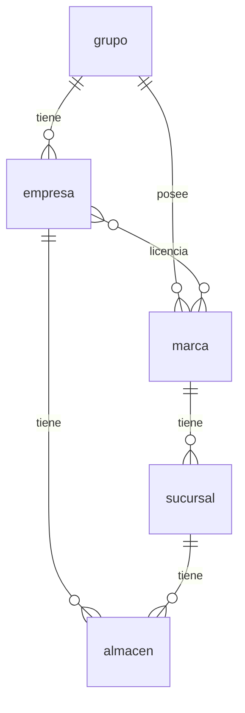
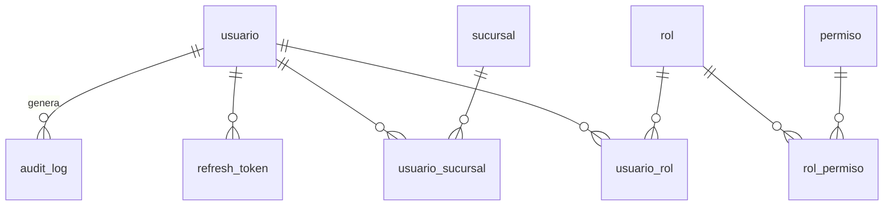
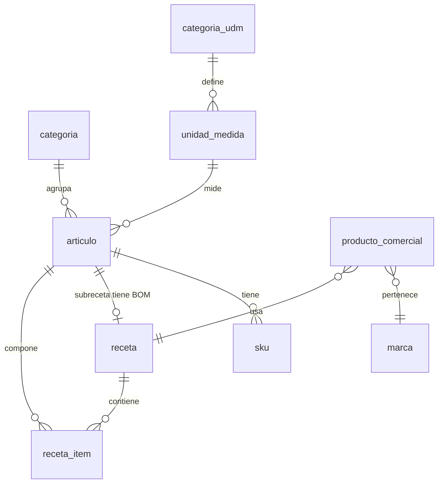

# Modelo de datos (v1)

Propuesta inicial. Cada módulo refina sus tablas al implementarse; los cambios
se versionan con Alembic y se reflejan aquí.

Convenciones: tablas y columnas en `snake_case`, PK `id` (UUID), timestamps
`created_at`/`updated_at`, borrado lógico `deleted_at` donde aplique.
Toda tabla de negocio referencia su tenant (directa o transitivamente).
**Aislamiento de tenant: filtro a nivel de aplicación con `empresa_id`
obligatorio + tests; RLS de Postgres solo si hiciera falta después
(ADR-004).** Migraciones SOLO vía Alembic — nunca cambios manuales en
producción.

Todo **Documento** de negocio (OC, venta, comprobante, asiento, guía de
remisión, solicitud, transferencia, contrato, planilla, reporte...) lleva:
fecha_elaboracion, responsable_id (visa), proposito, fecha_entrega_pactada
(RN-DOC-001). Generable manual o automáticamente (RN-DOC-002); inmutable
una vez emitido (RN-GEN-002).

- **archivo**: nombre, extension, mime_type, tamano_bytes, url_storage
  (S3), origen (`generado` | `subido`, RN-ARC-002), entidad_tipo +
  entidad_id (vínculo polimórfico a cualquier entidad, RN-ARC-001),
  plantilla_id (si `generado`), subido_por (usuario_id, si `subido`),
  timestamp.
- **plantilla**: nombre, area (rrhh, compras, comercial...), version,
  ruta_fuente (doc en `docs/templates/`), requiere_visado_legal (bool),
  vigente (bool). Base de los documentos generados por el ERP
  (`archivo.plantilla_id`, `contrato.plantilla_id`); una plantilla nueva
  se versiona, nunca se edita la vigente en silencio.
- **contrato** (transversal — lo suscriben distintas áreas): empresa_id,
  tipo (`laboral` | `alquiler` | `prestacion_servicios` | `comercial` |
  ...), plantilla_id, partes (contraparte + datos), objeto, motivo,
  area_suscriptora, visado_por (abogado, RN-CTR-002), autorizado_por
  (gerencia, RN-CTR-003), vigencia, estado. Todo contrato se registra en
  el ERP (RN-CTR-004).

## 1. Organización (transversal)

- **grupo**: nombre.
- **empresa**: grupo_id, razón social, RUC, domicilio fiscal, contacto, tipo
  (`operativa` | `logistica` | `servicios` | `asesoria` | `transporte`),
  config fiscal (Nubefact), zona_tributaria (`amazonia_ley27037` |
  `general` — determina exoneración de IGV y tasa reducida de IR,
  RN-IMP-001).
- **marca**: grupo_id (dueño de la identidad, no la empresa), nombre, skins
  de marca para la TPV, tipo (`restaurante` | `delivery` | `servicio` |
  ...). Sin activos tangibles propios.
- **licencia_marca**: empresa_id, marca_id — relación N:N; una empresa puede
  licenciar varias marcas y una marca puede ser licenciada por varias
  empresas (modelo franquicia interna). *Pendiente: condiciones/regalías.*
- **sucursal**: marca_id (una sola), empresa_id (vía licencia), nombre,
  dirección, estado, tenencia (`propia` | `alquilada` | `del_grupo` —
  `propia` paga predial/arbitrios, RN-IMP-004), horario_atencion
  (disponibilidad al público — el horario laboral de cada trabajador vive
  en `asistencia`/`contrato_laboral`, no aquí). Se
  abastece del almacén central de su empresa (excepción: gas/bebidas
  embotelladas directo de proveedor, gestión fuera de la sucursal).
- **almacen**: empresa_id, sucursal_id (NULL si central o de activos), tipo
  (`central` | `produccion` | `sucursal` | `activos` | ... — enum
  extensible, ej. futuro `transporte` como hub físico, RN-TRP-003),
  almacen_abastecedor_id
  (el central del que se abastece un almacén de sucursal/producción).
  `activos` es virtual (sin ubicación física ni stock de SKUs). Equipamiento
  y política FEFO/FIFO por tipo — ver
  [domain-model.md](../domain/domain-model.md#almacenes).
- **activo**: id_interno (4 alfanuméricos, autogenerado, inmutable,
  único), empresa_id, categoria_id (opcional), nombre, ficha técnica,
  número de serie, fecha de compra, proveedor_id, número de factura, valor
  de depreciación (calculada por el área contable), historial de
  mantenimiento/reparaciones, estado (`activo` | `de_baja`), archivado
  (bool — oculta de listados, nunca se elimina). Baja/venta exige acta_id
  (depreciación total requerida).
- **orden_mantenimiento**: activo_id (vehículo/equipamiento) o
  sucursal_id/almacen_id (si es local), tipo (`programado` |
  `adelantado`), frecuencia_recomendada (RN-MNT-001),
  proveedor_servicio_id, fecha_programada, motivo_adelanto (`desperfecto`
  | `baja_productividad`, si `adelantado`), reportado_por (trabajador),
  reportado_a (`compras` | `contabilidad`, RN-MNT-004), repuestos_utilizados
  (FK `repuesto_compatibilidad`), costo, estado.
- **repuesto_compatibilidad**: articulo_id (tipo=`repuesto`), activo_id
  (equipamiento o vehículo compatible), modelo_compatible,
  numero_serie_compatible (RN-RPT-002).
- **equipamiento**: activo_id (extiende `activo` 1:1), categoria_id
  (opcional, RN-EQP-004), etiqueta_codigo (RN-EQP-001), responsable_uso_id
  (trabajador), induccion_recibida (bool, RN-EQP-002). Reporte de avería
  → `orden_mantenimiento` (ver Mantenimiento). Mal uso comprobado → reporte
  a RRHH → `memorandum` o `amonestacion` (RN-EQP-003).
- **flota**: empresa_id, nombre, tipo_vehiculo predominante (`moto` |
  `carro` | `camion` | ...), descripcion. Agrupador de vehículos de la
  empresa — funciona como una categoría por la cual ubicar un vehículo
  (ej. "flota de reparto en moto", "flota de abastecimiento").
- **vehiculo**: activo_id (extiende `activo` 1:1), flota_id, tipo (`moto` |
  `carro` | `camion` | ...), placa, numero_motor, numero_chasis,
  kilometraje, tenencia (`propio` | `alquilado`), responsable_id
  (trabajador, RN-VEH-002), gps_equipado (bool), camara_equipada (bool),
  licenciado_a_trabajador_id (nullable — beneficio laboral, RN-VEH-003).
- **categoria**: empresa_id, nombre, asiento_contable_config (JSONB —
  cuenta contable por tipo de movimiento: compra, consumo, merma, etc.;
  opcional). Se asigna a `articulo` o `activo` (ambos con categoria_id
  opcional); libremente editable/eliminable, a diferencia del SKU.

## 1b. Geografía (transversal)

- **region**: nombre, características (geográficas, culturales, climáticas).
- **ciudad**: region_id, nombre. Agrupa zonas/áreas de servicio; alberga
  sucursales.
- **zona_servicio**: ciudad_id, nombre, tipo (`regular` | `limitada` |
  `restringida` | `fuera_de_area`), geocerca (polígono geográfico, trazada
  por la empresa), restricción horaria/climática (si `limitada`), motivo
  (si `restringida`).
- **sucursal_zona_servicio**: sucursal_id, zona_servicio_id — relación N:N
  (una sucursal se suscribe a un grupo de zonas).

## 2. Usuarios y seguridad (módulo users)

- **persona**: nombres, apellidos, tipo_documento (`dni` | `ce` |
  `pasaporte`), numero_documento (único), fecha_nacimiento, domicilio,
  contacto (teléfono/email). **Fuente única de datos de personas
  naturales** (party model): `trabajador`, `cliente` (natural) y `usuario`
  (humano) la referencian por `persona_id`, para no duplicar nombres. Los
  roles de un documento (emisor, destinatario, representante, aprobador)
  no son tablas: se atan a un `trabajador`/`persona` al emitir.
- **usuario**: username, pin_hash (Argon2id), persona_id (nullable — NULL
  si `agente_ia`), nombre_display (fallback para agente_ia), email, tipo
  (`humano` | `agente_ia`), activo.
- **rol**: nombre (admin, supervisor, cajero, almacenero, ...).
- **permiso**: código `modulo.accion` (ej. `inventory.contar` |
  `inventory.requerir` | `inventory.ajustar` | `inventory.autorizar_ajuste`
  | `inventory.transferir`), restricciones (JSONB — ej. alcance
  `sucursal_propia`\`toda_empresa`, visibilidad `stock_esperado`\`ciego`,
  RN-INV-005).
- **usuario_rol**, **rol_permiso**, **usuario_sucursal** (alcance por sucursal).
- **refresh_token**: hash, expiración, revocado.
- **audit_log**: usuario_id, entidad, entidad_id, acción, datos_antes (JSONB),
  datos_despues (JSONB), sucursal_id, ip, timestamp. Solo inserción.
- **auditoria**: empresa_id, tipo (`interna` | `externa`), area_responsable
  (si interna) o entidad_auditora (si externa — grupo empresarial o
  consultora), alcance (proceso/registro/estado evaluado), disparador
  (`rutina` | `inconsistencia_inventario` | `alerta_mala_practica` |
  `reclamo` | `sancion_regulatoria`, RN-AUD-004), hallazgos, fecha_inicio,
  fecha_cierre, estado. Distinta de `audit_log` (que es el rastro
  inmutable de cambios; una `auditoria` es el proceso de evaluación que
  puede consultar ese rastro).

## 3. Productos y recetas

- **categoria_udm**: nombre (peso, volumen, distancia, energía, datos,
  unidades...), unidad_base_id (FK a la `unidad_medida` de ratio 1:1 de
  referencia).
- **unidad_medida**: categoria_udm_id, nombre (Kilo, Doypack 2kg, Litro,
  Botella 500ml...), ratio (conversión respecto a la unidad base de su
  categoría — ej. Doypack 2kg = 2:1 sobre Kilo). Un artículo/receta/
  producto comercial solo admite UdM de su propia categoría (RN-UDM-001).
  Default: categoría "Unidades" con UdM base "Unidad".
- **articulo** (inventariable): id_interno (4 alfanuméricos, autogenerado,
  inmutable, único — RN-GEN-005), nombre, categoria_id (opcional),
  unidad_medida_id, tipo (`insumo` | `subreceta` | `mercaderia` | `empaque`
  | `repuesto` | `suministro` — **enum extensible**: se agregan tipos
  nuevos cuando el negocio lo requiera, sin migración destructiva),
  costo promedio, archivado (bool — al descontinuarse, oculta sin
  eliminar, RN-GEN-006). Es el concepto genérico (ej. "Harina de Trigo");
  vive en almacenes a través de sus SKU. `mercaderia` es de venta directa
  (sin receta transformadora), se vende vía un producto_comercial cuya
  receta es 1 unidad de sí misma. `empaque` no se incluye en receta_item;
  su consumo se configura en producto_comercial (ver abajo); cubre también
  consumibles que acompañan la venta (servilletas, sachets de salsa) — se
  descuentan por venta según configuración. `suministro` es de consumo
  interno, no ligado a venta ni a receta: productos de limpieza, útiles de
  oficina, etc. — se descuenta por movimiento de consumo del área.
- **sku**: articulo_id, código (mayúsculas sin tildes, números, guiones —
  nomenclatura y formato del área de compras), codigo_barras (EAN/UPC del
  proveedor, opcional — no todo SKU lo tiene, RN-COD-001), prioridad,
  activo (baja lógica — nunca se elimina, es historial). Un artículo puede
  tener varios SKU (una marca/proveedor cada uno); el consumo usa el de
  mayor prioridad disponible.
- **receta**: nombre, rendimiento (cantidad + unidad), flexible (bool),
  criterio_ajuste (texto — solo si flexible, lo asigna Producción,
  RN-PRD-010). BOM de un producto comercial o de una subreceta; su
  artículo resultante (si es subreceta) puede encadenarse como ingrediente
  de otra receta/subreceta. Creación y modificación a cargo de Producción/
  I+D; toda modificación genera reporte, recalcula costos, solicita
  actualizar manuales y notifica a los involucrados en fabricación
  (RN-PRD-008/009).
- **lote**: código (asignado por el ERP, nomenclatura de Producción),
  articulo_id, orden_produccion_id, fecha_elaboracion, manipulador_id,
  envasador_id, lugar_elaboracion, linea_produccion, variables_proceso
  (JSONB — ej. insumos ajustados en receta flexible), fecha_vencimiento
  (normativa + análisis de laboratorio si es de cocina de producción,
  RN-VNC-001; declarada por proveedor si es de compra, RN-VNC-002),
  qr_payload (SKU + código de lote codificados juntos, RN-COD-002). Se
  imprime en la etiqueta de cada artículo producido (cantidad, UdM, código
  de barras/QR, lote, fecha de vencimiento, condiciones de almacenamiento/
  transporte — RN-LOT-002).
- **receta_item**: receta_id, articulo_id, cantidad, merma_pct.
- **producto_comercial** (vendible): id_interno (4 alfanuméricos,
  autogenerado, inmutable, único), marca_id, nombre, receta_id, categoría
  de carta, activo (bool — al descontinuarse pasa a false/archivado, nunca
  se elimina), margen_contribucion (calculado; revisado por comercial/
  contabilidad para pricing), empaque_id (FK articulo tipo=empaque,
  nullable), modalidades_empaque (array `mesa`|`takeout`|`delivery` — en
  cuáles se descuenta stock del empaque, RN-EMP-003). Precios en
  **lista_precio** / **precio** (por sucursal/canal/modalidad de consumo,
  RN-MDC-003). Puede formar parte de uno o más **combo** (N:N).
- **modificador**: producto_comercial_id, tipo (`tamano` | `combinacion` |
  `extra` | `resta`), receta_delta (ítems que agrega/quita de la receta
  base), delta de precio. El orden de cálculo es siempre
  tamaño → combinación → extra → resta (RN-PRD-004), independiente del
  orden de selección del cliente/trabajador.
- **variante_producto**: producto_comercial_id (base), modificadores
  aplicados (ordenados), receta_resultante_id, precio_resultante. Es el
  producto comercial final vendido.
- **combo**: es un producto_comercial (extiende 1:1 o flag `es_combo`)
  que une varios productos comerciales para venderse juntos bajo un nombre
  y precio propios — sube el ticket medio y ayuda a rotar inventarios.
  Ítems en **combo_item** (producto_comercial_id componente, cantidad).
  El descuento de stock se hace por la receta de cada componente; el
  precio del combo es propio (normalmente menor a la suma de los
  componentes) y su margen de contribución se calcula sobre el costo
  variable agregado de los componentes.

Separación clave: producto comercial ≠ artículo inventariable. La venta
descuenta stock vía la receta (ver [../domain/domain-model.md](../domain/domain-model.md)).

- **lista_precio**: nombre, marca_id o grupo_id (quién la define), ámbito
  (sucursal/canal/modalidad de consumo), segmento_consumidor (opcional),
  es_promocional (bool), precio_minimo, precio_maximo, moneda (fija, PEN —
  RN-PRC-004), vigente_desde, vigente_hasta. Creada por el área comercial
  con asesoría contable (RN-PRC-005).
- **promocion**: nombre, objetivo (`lanzamiento` | `fidelizacion` |
  `rotacion_inventario` | `ticket_promedio`), lista_precio_id (opcional),
  material_promocional (URL/JSONB), guion_atencion (texto, RN-PRM-002),
  canales (array), horarios/fechas de vigencia, capacitacion_requerida
  (bool).
- **precio**: producto_comercial_id, lista_precio_id, monto. Fijo e
  innegociable en POS (RN-PRC-003); fuera de POS (ej. cotización) admite
  rango_negociacion_min/max definido por el área comercial.

- **servicio** (vendible, intangible): id_interno (4 alfanuméricos,
  autogenerado, inmutable, único), marca_id, nombre, tipo (`delivery` |
  ... — catálogo futuro), fórmula de costeo (JSONB, propia por tipo),
  margen_contribucion, pct_emergencia, tarifa (fija o por distancia —
  delivery usa por distancia; RN-SRV-001..003), archivado (bool — oculta
  de listados, nunca se elimina). No referencia receta_id.

## 4. Inventario (módulo inventory)

- **stock**: almacen_id, sku_id, cantidad (en la UdM del artículo),
  stock_minimo (= punto de reorden: demanda_diaria × lead_time_dias +
  stock_seguridad, default stock_seguridad = demanda_diaria, RN-INV-013),
  stock_maximo (única por par almacén/SKU; reglas por artículo definidas
  por Producción/Contabilidad/Logística, RN-INV-008). Alerta al llegar a
  stock_minimo (RN-PRD-007).
  fecha_apertura, condicion_almacenamiento (`refrigerado` | `congelado` |
  `ambiente`) — nullable, para calcular vida útil tras apertura
  (RN-VNC-003).
- **stock_lote**: almacen_id, sku_id, lote_id, cantidad, estado
  (`disponible` | `bloqueado` | `agotado`). Detalle del stock por lote —
  la suma de sus cantidades por almacén/SKU cuadra con `stock.cantidad`.
  Es lo que hace implementable FEFO/FIFO: el picking sugiere el lote
  según `lote.fecha_vencimiento` (o fecha de ingreso); alerta de
  vencimiento próximo con ventana configurable por artículo. Un lote
  vencido hallado aún `disponible` se bloquea de inmediato y dispara
  `inventory.lote_vencido_detectado` → notificación + memorándum al
  responsable del almacén (vía RRHH), para que no se repita — apoya la
  rotación de inventarios (RN-VNC-001..003).
- **reserva_stock**: almacen_id, sku_id, cantidad, tipo (`solicitud` |
  `produccion` | `merma` | `carrito`), referencia_id (solicitud_id/
  orden_produccion_id/carrito_id; o motivo `devolucion`|`rechazo_sucursal`|
  `auditoria` si tipo=`merma`),
  estado (`activa` | `liberada` | `consumida` | `pendiente_desecho`),
  creado_por, liberado_por (nullable), timestamp. Stock disponible = stock
  físico − Σ reservas activas (RN-INV-009).
- **conteo**: almacen_id, tipo (`rutina` | `ajuste` | `auditoria`), fecha,
  usuario_id. Ítems en **conteo_item** (sku_id, cantidad_contada,
  cantidad_sistema, diferencia). Una diferencia genera un `ajuste`.
- **ajuste**: almacen_id, conteo_id (opcional — origen), motivo
  (`sobrante` | `faltante` | `merma` | `error_registro`), solicitado_por,
  aprobado_por (permisos separados `inventory.solicitar_ajuste` /
  `inventory.aprobar_ajuste`, nunca el mismo usuario), dentro_margen
  (bool — fuera del margen de error exige investigación documentada y
  dispara `inventory.ajuste_fuera_margen`, RN-INV-015), estado. Al
  aprobarse genera el `movimiento_inventario` tipo `ajuste`.
- **movimiento_inventario**: almacen_id, sku_id, cantidad (+/-), tipo
  (`recepcion_compra` | `transferencia_salida` | `transferencia_entrada` |
  `consumo_venta` | `consumo_produccion` | `produccion_entrada` | `ajuste` |
  `devolucion`), motivo_ajuste (`sobrante` | `faltante` | `merma` |
  `error_registro` — solo si tipo=`ajuste`, dentro del margen de error de
  almacén/contabilidad, RN-INV-015), referencia (doc origen), usuario_id,
  timestamp. Solo inserción — el stock es derivable y auditable.
- **devolucion**: origen (`proveedor` | `sucursal` | `cliente`),
  referencia_id, almacen_origen_id, motivo (`vencido` | `dañado` |
  `incumplimiento_plazo` | `no_requerido` | `error_solicitud` |
  `duplicidad`), destino (`desecho` | `auditoria` | `reintegro`), items
  (sku, cantidad), reporte_dirigido_a (`almacen` | `comercial`, RN-INV-020).
  Genera el `movimiento_inventario` tipo `devolucion` correspondiente.
- **solicitud_insumos**: sucursal_id, estado (`pendiente` | `aprobada` |
  `rechazada` | `en_picking` | `despachada` | `recibida`), aprobador_id.
  Ítems en **solicitud_item**. Caso concreto (ámbito inventario) del
  concepto marco Solicitud (RN-DOC-005) — comparte fecha_elaboracion/
  responsable_id/proposito de Documento (ver convenciones arriba).
- **transferencia**: origen_almacen_id, destino_almacen_id, solicitud_id,
  estado (`en_transito` | `recibida`), ítems con cantidad enviada/recibida
  (diferencias auditables). Mientras `en_transito` ("almacén de transporte"
  — no es ubicación física, es el estado del inventario ya descontado de
  origen y aún no ingresado a destino): transportista_id, vehiculo_id,
  tracking GPS, tiempos de ruta y de entrega.
- **guia_remision**: empresa_id, transferencia_id (opcional — traslado
  entre almacenes), fecha_inicio_traslado, items (articulo/sku, cantidad),
  ruc_emisor, ruc_receptor, lugar_origen, lugar_destino, motivo_traslado,
  chofer, vehiculo_id. Emitida por el área de almacén (RN-GDR-002);
  resguardada por contabilidad (RN-GDR-003).

## 5. Compras (módulo purchases)

- **proveedor**: RUC + razon_social (si empresa) o persona_id (si persona
  natural, ej. RHE), contacto, condiciones (condición de pago: contado o
  crédito + plazo pactado — accounting la usa al ejecutar el pago),
  formal (bool — `false` para proveedor informal de mercado/supermercado:
  sin RUC obligatorio, compra sin OC vía caja chica, RN-CMP-011..016),
  clasificacion (`regular` | `preferente` — preferente habilita el camino
  simplificado de OC sin cotización comparativa), afecto_igv (bool —
  dentro/fuera de región amazónica, RN-IMP-002), sujeto_spot (bool +
  porcentaje_deteccion, RN-IMP-003). Si natural, nombre/documento se leen
  de `persona` (RN-GEN-007).
- **evaluacion_proveedor**: proveedor_id, indicador_automatico (JSONB —
  cumplimiento de plazo, conformidad de recepción, variación de precio;
  recalculado en cada recepción, sin batch aparte), registro_cualitativo
  (revisión humana solo sobre alertas), periodo, estado. Emite
  `purchases.evaluacion_proveedor_actualizada`.
- **cotizacion**: dirección (`de_proveedor` | `a_cliente`), proveedor_id
  (si es de proveedor) o cliente_id (si es a cliente), emisor, receptor,
  items (descripcion, precio_unitario, cantidad, total), condiciones_pago,
  impuestos, medios_pago_aceptados, vigencia_hasta, estado. No compromete
  la compra (RN-DOC-007); de proveedor la solicita compras y la evalúa
  contabilidad/finanzas (RN-DOC-008); a cliente la emite comercial según
  tarifario/lista de precios (RN-DOC-009).
- **orden_compra**: proveedor_id, tipo (`insumo` | `activo`),
  cotizacion_id (opcional — origen; precios unitarios se actualizan con la
  respuesta, RN-CMP-004; camino simplificado: proveedor `preferente` +
  ítem recurrente emite sin cotización, sustento = requerimiento de
  almacén + factura), requerimiento_activo_id (obligatorio si tipo
  `activo`), almacen_destino_id, estado (`borrador` | `emitida` |
  `recibida_parcial` | `recibida` | `anulada`), idempotency_key. Ítems en
  **orden_compra_item** (articulo, cantidad, costo).
- **requerimiento_activo**: area_solicitante, especificacion (ficha
  técnica requerida), aprobado_area (bool + aprobador), aprobado_gerencia
  (bool + aprobador — dos aprobaciones distintas, ambas registradas,
  bloqueo a nivel de dominio antes de emitir la OC tipo `activo`),
  cotizaciones vinculadas (mínimo 2), estado.
- **recepcion_compra**: orden_compra_id, comprobante_id (sustento,
  RN-CMP-005), asiento_id, movimiento_dinero_id (egreso o crédito con
  plazo, RN-CMP-006/007 — módulo tesorería, ver sección 9), ítems
  recibidos en **recepcion_item** → genera `movimiento_inventario` en
  almacén central y recalcula `evaluacion_proveedor.indicador_automatico`.
  La conformidad del comprobante emite `purchases.comprobante_conforme`;
  **accounting ejecuta el pago** según la condición de la ficha del
  proveedor — purchases nunca paga.
- **caja_chica_compras**: empresa_id, responsable_id (encargado de
  compras), fondo_fijo (monto), estado. Fondo fijo para compra menor a
  proveedor informal.
- **caja_chica_movimiento**: caja_chica_id, compra_directa_id (o concepto),
  monto, comprobante_id (obligatorio — sin comprobante no se persiste),
  fecha. Solo inserción.
- **compra_directa**: proveedor_id (informal), requerimiento origen
  (sucursal/área), items, monto, comprobante_id (obligatorio),
  caja_chica_movimiento_id, idempotency_key. Compra sin OC (RN-CMP-011).
- **rendicion_caja_chica**: caja_chica_id, periodo (semana), gasto_total,
  efectivo_restante, diferencia (gasto + efectivo − fondo_fijo), estado
  (`conforme` | `con_diferencia` — no se repone el fondo hasta resolverse;
  faltante no sustentado → reporte a RRHH, memorándum y descuento por
  planilla, RN-CMP-017), conciliado_por (accounting). Emite
  `purchases.caja_chica_rendida`.

## 6. Ventas (módulo sales)

- **punto_venta**: sucursal_id, canal (`trabajador` | `web` | `kiosko`),
  hardware_id (NULL si web), modalidades_habilitadas (array
  `mesa`|`takeout`|`delivery`, RN-MDC-001), datos_minimos_por_modalidad
  (JSONB — ej. delivery exige dirección, RN-MDC-002), política de pago
  (`adelantado` | `al_finalizar` — según autoatención o atención en mesa).
  Solo `trabajador` (si el usuario es cajero), `kiosko` y `web` emiten
  comprobantes. kpis (JSONB — si `trabajador`: tiempo_atencion, upsell,
  errores_digitacion, satisfaccion; si `web`/`kiosko`: conversion,
  errores_sistema, clics_completar_pedido, satisfaccion, upsell,
  ticket_promedio; ambos: tasa_registro_clientes,
  venta_productos_promocionales, RN-CNV-002/003).
- **central_pedidos**: nombre. Asociada a N marcas/sucursales/ciudades vía
  **central_pedidos_sucursal** (N:N). Canal de origen del pedido (`whatsapp`
  | `mensajeria` | `llamada` | `email`), agente_id (humano o `agente_ia`),
  tiempo_atencion, upsell_efectivo (bool), tiempo_espera_calculado (según
  saturación del local + ruta de entrega). Ventana de anulación: 5 min desde
  emisión. Escalamiento genera **reporte_escalamiento** (supervisor o
  encargado de sucursal).
- **carrito**: cliente_id/usuario_id, punto_venta_id, items (variante_producto_id,
  cantidad), reserva_stock_id (origen `carrito`, RN-CAR-001), estado
  (`abierto` | `enviado` | `abandonado` | `convertido_a_venta`). Al enviarse,
  se convierte en `venta` (estado `orden`), y según si el POS admite
  pedidos abiertos, va directo a KDS o primero a la pasarela de pago
  (RN-CAR-002).

Nota: al confirmarse, el pedido del cliente se convierte en una **Orden de
Pedido** (mandatoria hacia cocina/producción, RN-DOC-006) — ya no es una
Solicitud.

- **venta**: sucursal_id, punto_venta_id, canal (`pdv` | `agente_ia` |
  `delivery`), modalidad (`mesa` | `takeout` | `delivery` — determina si se
  descuenta empaque según config del producto comercial), cotizacion_id
  (opcional — venta de servicio o del área comercial originada en una
  cotización aceptada por el cliente, RN-COM-004), cliente_id (opcional),
  usuario_id (cajero o agente), estado (`orden` | `preparacion` | `listo` |
  `entrega` | `pagada` | `facturada` | `entregado` | `devolucion` |
  `anulada` — pago y comprobante en orden flexible, RN-COM-005/006), total,
  idempotency_key, repartidor_externo_plataforma (nullable — `rappi` |
  `ubereats` | `pedidosya`... si el delivery lo hizo un rider de
  plataforma externa, sin vínculo laboral ni gestión como Vehículo/
  Mantenimiento propio, RN-PER-003).
- **venta_item**: producto_comercial_id, cantidad, precio unitario, descuento.
- **medio_pago**: nombre, direccion (`cobro` | `pago` | `ambos`), tipo
  (`efectivo` | `tarjeta_credito` | `tarjeta_debito` | `billetera_digital`
  | `transferencia` | `cheque` | `credito_empresarial`), comision_pct,
  activo (puede desactivarse/rechazarse), activa_promocion (bool),
  lista_precio_credito_id (opcional, si a crédito aplica otra lista de
  precios, RN-MDP-001).
- **pago**: venta_id, medio_pago_id, pasarela (izipay), referencia
  externa, estado.
- **custodia_efectivo**: apertura_caja_id, monto, responsable_actual_id,
  estado (`en_caja` | `en_supervisor` | `en_contabilidad` | `disponible`),
  timestamps por relevo (RN-MDP-002). Cada transición exige confirmación
  de valores correctos por el receptor.
- **apertura_caja** (PROC-CTB-002): punto_venta_id, cajero_id,
  relevo_encargado_id (relevo autenticado por ambas partes con
  usuario+PIN), monto_apertura (RN-POS-003), detalle_denominaciones
  (JSONB — conteo por billete/moneda), diferencia_reportada (opcional —
  no se apertura sin registrarla; notifica a contabilidad y gerencia),
  pos_verificados (JSONB — serie/código de comercio de cada POS de
  tarjeta, RN-POS-010), timestamp. Inicia la cadena de custodia inversa
  (RN-MDP-002).
- **cierre_caja** (PROC-CTB-001 v1.1): apertura_caja_id, cajero_id,
  montos_esperados (JSONB por medio de pago), montos_reales (JSONB),
  descuadre (monto + atribución: `cajero` | `tercero_reportado` |
  `encargado` — según reporte previo y validación del relevo),
  reportes_pos (archivos de cierre de lote), relevos (cajero → encargado
  → contabilidad, cada uno autenticado con usuario+PIN, timestamps),
  custodia (`local_caja_fuerte` | `traslado_contabilidad`, RN-MDP-006),
  estado. Irregularidades notifican a contabilidad, gerencia y RRHH.
- **arqueo**: punto_venta_id, tipo (`sorpresa` | `programado`),
  realizado_por, monto_esperado, monto_contado, diferencia, acta_id.
  Verificación puntual de caja fuera del ciclo apertura/cierre.
- **reporte_escalamiento**: origen (`central_pedidos` | `punto_venta`),
  sucursal_id, venta_id o carrito_id (opcional), reportado_por (personal
  de atención al cliente), motivo (`queja` | `demora` | `error_sistema` |
  `desistimiento_no_resuelto` | ...), descripcion del problema. Flujo de
  escalamiento en cadena: alerta al **supervisor**, que intenta
  resolverlo y redacta su solución en el reporte; si no puede, escala al
  **área comercial o gerencia**, que realiza acciones y las reporta en el
  mismo documento. Campos: nivel_actual (`supervisor` | `comercial` |
  `gerencia`), acciones (historial por nivel: quién, qué, cuándo),
  estado (`abierto` | `resuelto_supervisor` | `escalado` | `resuelto` |
  `cerrado`). Se almacena en el ERP para **mejora continua** (insumo del
  SOP de mejora continua de experiencia de cliente, área Comercial).
- **carta_disputa_pago**: operacion_id (venta/pago), fecha, hora,
  cliente_id, referencia_pago, lote, monto, procedencia (o motivo de
  ausencia), emitida_por (área contable, RN-MDP-004).
- **comprobante**: empresa_id, venta_id (o compra_id si es de egreso),
  direccion (`emitido` | `recibido`), tipo (`boleta` | `factura` | `nc` si
  emitido; `factura` | `rhe` | `boleta` | `ticket_compra` si recibido,
  RN-CPP-001/002), serie (asignada por punto_venta_id), correlativo (único
  por serie/empresa — nunca se repite, RN-CPP-007), sustento (`efectivo` |
  `voucher_medio_pago` | `movimiento_bancario` | `contrato_credito`,
  RN-CPP-003), idempotency_key (anti-duplicado/reemisión, RN-CPP-008),
  estado Nubefact, respuesta (JSONB).
- **cliente**: grupo_id (transversal al grupo, no a una empresa —
  RN-PTS-001), tipo (`natural` | `juridico` — ej. cliente corporativo:
  catering/eventos), persona_id (si `natural`) o razon_social + ruc (si
  `juridico`), contacto (base para CRM futuro). Si natural, nombre y
  documento se leen de `persona` — no se duplican (RN-GEN-007). `cliente_id`
  es opcional en `venta` — cliente anónimo es un caso válido (RN-PER-005).
- **cuenta_puntos**: cliente_id, saldo. Un solo saldo válido en todas las
  marcas/empresas del grupo (RN-PTS-001).
- **puntos_movimiento**: cuenta_puntos_id, tipo (`acumulacion` | `canje` |
  `expiracion`), cantidad, venta_id (si acumulación/canje),
  producto_comercial_id (para calcular valor, RN-PTS-002), fecha_vigencia
  (RN-PTS-003), timestamp. Solo inserción — el saldo es su suma.
- **programa_puntos_config**: producto_comercial_id (opcional, o regla por
  monto), valor_puntos (por producto o por S/ consumido), vigencia_dias.
  Definida por comercial y marketing (RN-PTS-002).

Evento `sales.venta_confirmada` → inventory descuenta insumos según receta.

- **encuesta_satisfaccion** (módulo futuro marketing): venta_id, cliente_id,
  canal (`pos` | `whatsapp` | `link`), fecha_envio, fecha_respuesta
  (opcional), puntaje (opcional hasta responder), comentario (opcional),
  estado (`enviada` | `respondida` | `expirada`). Selectiva — no toda venta
  genera una fila (RN-COM-007); requiere `cliente_id` no nulo.

## 7. Producción (módulo futuro production)

- **orden_produccion**: articulo_id (subreceta), cantidad, almacen_id, estado.
  Consume insumos (`consumo_produccion`) y produce (`produccion_entrada`).
  desperdicio_articulo_id (FK articulo, opcional — producto derivado
  aprovechable, ligado a la receta, RN-INV-018), merma_cantidad +
  merma_motivo (opcional — pérdida no aprovechable de la orden,
  RN-INV-017).
- **reporte_produccion**: jornada (fecha/turno), visado_por (encargado o
  jefe de cocina, RN-DOC-010), ordenes_produccion (consumo por receta,
  lotes producidos), solicitudes_cubiertas, solicitudes_pendientes,
  observaciones, merma_total, desperdicio_total. Generado automáticamente
  al finalizar la jornada con los datos registrados durante esta.

## 8. Contabilidad (módulo accounting — spec inicial)

- **cuenta_contable** (plan de cuentas), **asiento**, **asiento_linea**
  (debe/haber), **periodo_contable**. Los módulos operativos publican eventos
  que generan asientos. Detalle al implementar.
- **declaracion_itan**: empresa_id, periodo, activos_netos, umbral_legal,
  base_imponible (excedente), monto, credito_ir_aplicado (RN-IMP-006).

## 8b. Recursos humanos (módulo rrhh — spec inicial)

Un `usuario` (login) no es lo mismo que un `trabajador` (vínculo laboral):
un trabajador puede o no tener usuario, y no todo usuario es trabajador
(ej. agente_ia). Todos los documentos de RRHH pertenecen a una empresa
(tenant) y se archivan/resguardan por el área correspondiente.

- **trabajador**: empresa_id, persona_id (datos personales — nombres,
  documento, domicilio, etc.), usuario_id (opcional), cargo, area,
  tipo_vinculo (`planilla` | `practicante` | `locacion_servicios`),
  regimen_laboral, fecha_ingreso, fecha_cese (nullable), remuneracion_base
  (o subvención si `practicante`, RN-PER-001), sistema_pensiones (`onp` |
  `afp` + afp_nombre), tiene_poderes (bool — gerencia/directivo, facultades
  de representación), registra_asistencia (bool — **siempre `false` si
  `locacion_servicios`**, RN-PER-002), estado (`activo` | `cesado` |
  `suspendido`). Los nombres/documento NO viven aquí, viven en `persona`
  (RN-GEN-007).
- **postulante**: persona_id, puesto_postulado, fecha_postulacion,
  consentimiento_datos (bool + fecha, RN-PER-004), plazo_conservacion_declarado
  (fecha, según aviso de privacidad), cv_archivo_id (FK `archivo`), estado
  (`en_proceso` | `rechazado` | `contratado`).
- **socio**: grupo_id o empresa_id, persona_id o razon_social+ruc,
  porcentaje_participacion. Referenciado en aprobaciones (RN-GRP-006,
  RN-MAR-004); no implica `trabajador` ni `usuario`.
- **contrato_laboral**: es un `contrato` tipo `laboral` (entidad
  transversal, ver convenciones al inicio del documento) — modalidad
  (`indeterminado` | `plazo_fijo` | `parcial` | ...), trabajador_id,
  jornada, remuneracion, fecha_inicio, fecha_fin (si plazo fijo).
- **boleta_pago**: trabajador_id, periodo (mes/año), dias_laborados,
  remuneracion, ingresos (JSONB — básico, asignación familiar, HHEE,
  bonos), descuentos (JSONB — ONP/AFP, renta 5ta, adelantos, faltas),
  aportes_empleador (EsSalud), neto_pagar, fecha_pago, firma/constancia.
  Refleja la planilla electrónica (PLAME).
- **memorandum**: empresa_id, emisor_id, destinatario_id (trabajador o
  área), asunto, cuerpo, fecha. Comunicación interna (no sanción por sí).
- **amonestacion**: trabajador_id, tipo (`verbal` | `escrita`), falta,
  fecha_hecho, fecha_emision, emisor_id, descargo (texto + plazo),
  sancion_relacionada. Escalón previo a suspensión/despido (RN-RRHH-004).
- **acta**: empresa_id, tipo (`reunion` | `incidente` | `entrega_cargo` |
  `arqueo` | `verificacion` | ...), fecha, lugar, hechos, participantes
  (firmas). Deja constancia formal de un hecho.
- **certificado_trabajo**: trabajador_id, fecha_emision, tiempo_servicios,
  cargos, conducta_desempeno (opcional, a solicitud). Se emite al cese
  dentro de 48 h (RN-RRHH-002).
- **liquidacion_bss**: trabajador_id, fecha_cese, cts_pendiente,
  vacaciones_truncas, gratificacion_trunca, otros_adeudos, total. Pago
  dentro de 48 h del cese (RN-RRHH-003).
- **solicitud_permiso**: es una `solicitud` (ver §Documentos) — trabajador_id,
  tipo (`vacaciones` | `licencia_con_goce` | `licencia_sin_goce` |
  `permiso_horas`), fecha_desde, fecha_hasta/horas, motivo, estado
  (`pendiente` | `aprobada` | `rechazada`), aprobador_id.
- **pacto_permanencia**: trabajador_id, capacitacion (descripción, tipo:
  curso/posgrado/diplomado/capacitación), costo_financiado, plazo_permanencia
  (meses), formula_reembolso (proporcional al tiempo no cumplido), fecha
  inicio, fecha_fin_compromiso. Razonable y proporcional (RN-RRHH-006).
- **asistencia**: trabajador_id, fecha, marcaciones (entrada/salida),
  tardanza_min, horas_extra. Registro de control de asistencia obligatorio.

Los documentos de RRHH que son cartas/actas usan plantillas versionadas
(ver `docs/templates/rrhh/`), rellenadas con datos del ERP + campos
manuales, y visadas por abogado antes de uso (RN-CTR-002).

## 9. Módulos futuros

Transporte (ruta, despacho), tesorería, activos, proyectos, BI/reportes:
se especifican en su módulo antes de implementarse. Caja ya no es futuro:
apertura/cierre/arqueo quedaron especificados en §6 (PROC-CTB-001/002).
