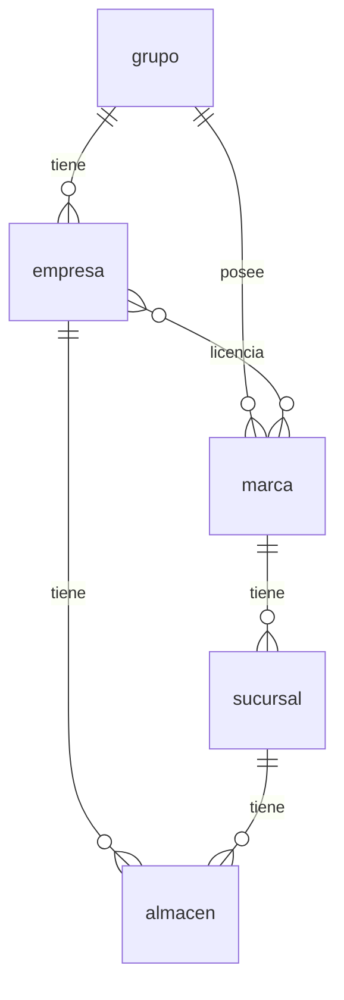
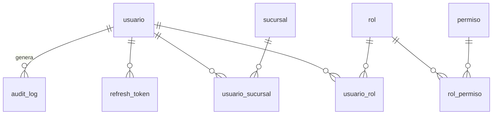
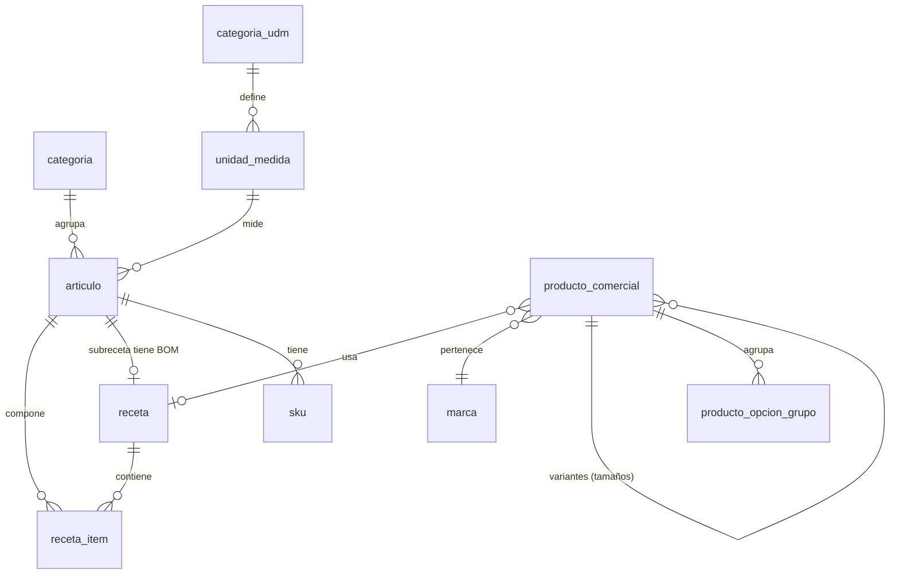

# Modelo de datos (v1)

Propuesta inicial. Cada módulo refina sus tablas al implementarse; los cambios
se versionan con Alembic y se reflejan aquí.

Convenciones: tablas y columnas en `snake_case`, PK `id` (UUID), timestamps
`created_at`/`updated_at`, borrado lógico `deleted_at` donde aplique.
Toda tabla de negocio referencia su tenant (directa o transitivamente).
**Aislamiento de tenant: filtro a nivel de aplicación con `empresa_id`
obligatorio + tests; RLS de Postgres solo si hiciera falta después
(ADR-004).** Migraciones SOLO vía Alembic — nunca cambios manuales en
producción.

Todo **Documento** de negocio (OC, venta, comprobante, asiento, guía de
remisión, solicitud, transferencia, contrato, planilla, reporte...) lleva:
fecha_elaboracion, responsable_id (visa), proposito, fecha_entrega_pactada
(RN-DOC-001). Generable manual o automáticamente (RN-DOC-002); inmutable
una vez emitido (RN-GEN-002).

- **archivo**: nombre, extension, mime_type, tamano_bytes, url_storage
  (S3), origen (`generado` | `subido`, RN-ARC-002), entidad_tipo +
  entidad_id (vínculo polimórfico a cualquier entidad, RN-ARC-001),
  plantilla_id (si `generado`), subido_por (usuario_id, si `subido`),
  timestamp.
- **plantilla**: nombre, area (rrhh, compras, comercial...), version,
  ruta_fuente (doc en `docs/templates/`), requiere_visado_legal (bool),
  vigente (bool). Base de los documentos generados por el ERP
  (`archivo.plantilla_id`, `contrato.plantilla_id`); una plantilla nueva
  se versiona, nunca se edita la vigente en silencio.
- **contrato** (transversal — lo suscriben distintas áreas): empresa_id,
  tipo (`laboral` | `alquiler` | `prestacion_servicios` | `comercial` |
  ...), plantilla_id, partes (contraparte + datos), objeto, motivo,
  area_suscriptora, visado_por (abogado, RN-CTR-002), autorizado_por
  (gerencia, RN-CTR-003), vigencia, estado. Todo contrato se registra en
  el ERP (RN-CTR-004).

## 1. Organización (transversal)

- **grupo**: nombre.
- **empresa**: grupo_id, razón social, RUC, domicilio fiscal, contacto, tipo
  (`operativa` | `logistica` | `servicios` | `asesoria` | `transporte`),
  config fiscal (proveedor de facturación), zona_tributaria (`amazonia_ley27037` |
  `general` — determina exoneración de IGV y tasa reducida de IR,
  RN-IMP-001).
- **marca**: grupo_id (dueño de la identidad, no la empresa), nombre, skins
  de marca para la TPV, tipo (`restaurante` | `delivery` | `servicio` |
  ...). Sin activos tangibles propios.
- **licencia_marca**: empresa_id, marca_id — relación N:N; una empresa puede
  licenciar varias marcas y una marca puede ser licenciada por varias
  empresas (modelo franquicia interna). *Pendiente: condiciones/regalías.*
- **sucursal**: marca_id (una sola), empresa_id (vía licencia), nombre,
  dirección, estado, tenencia (`propia` | `alquilada` | `del_grupo` —
  `propia` paga predial/arbitrios, RN-IMP-004), horario_atencion
  (disponibilidad al público — el horario laboral de cada trabajador vive
  en `asistencia`/`contrato_laboral`, no aquí). Se
  abastece del almacén central de su empresa (excepción: gas/bebidas
  embotelladas directo de proveedor, gestión fuera de la sucursal).
- **almacen**: empresa_id, sucursal_id (NULL si central o de activos), tipo
  (`central` | `produccion` | `sucursal` | `activos` | ... — enum
  extensible, ej. futuro `transporte` como hub físico, RN-TRP-003),
  direccion (NULL en los virtuales y en los de sucursal, que heredan la de
  su sucursal — el central no cuelga de ninguna y necesita la suya),
  almacen_abastecedor_id
  (el central del que se abastece un almacén de sucursal/producción).
  `activos` es virtual (sin ubicación física ni stock de SKUs). Equipamiento
  y política FEFO/FIFO por tipo — ver
  [domain-model.md](../domain/domain-model.md#almacenes).
- **activo**: id_interno (4 alfanuméricos, autogenerado, inmutable,
  único), empresa_id, categoria_id (opcional), nombre, ficha técnica,
  número de serie, fecha de compra, proveedor_id, número de factura, valor
  de depreciación (calculada por el área contable), historial de
  mantenimiento/reparaciones, estado (`activo` | `de_baja`), archivado
  (bool — oculta de listados, nunca se elimina). Baja/venta exige acta_id
  (depreciación total requerida).
- **orden_mantenimiento**: activo_id (vehículo/equipamiento) o
  sucursal_id/almacen_id (si es local), tipo (`programado` |
  `adelantado`), frecuencia_recomendada (RN-MNT-001),
  proveedor_servicio_id, fecha_programada, motivo_adelanto (`desperfecto`
  | `baja_productividad`, si `adelantado`), reportado_por (trabajador),
  reportado_a (`compras` | `contabilidad`, RN-MNT-004), repuestos_utilizados
  (FK `repuesto_compatibilidad`), costo, estado.
- **repuesto_compatibilidad**: articulo_id (tipo=`repuesto`), activo_id
  (equipamiento o vehículo compatible), modelo_compatible,
  numero_serie_compatible (RN-RPT-002).
- **equipamiento**: activo_id (extiende `activo` 1:1), categoria_id
  (opcional, RN-EQP-004), etiqueta_codigo (RN-EQP-001), responsable_uso_id
  (trabajador), induccion_recibida (bool, RN-EQP-002). Reporte de avería
  → `orden_mantenimiento` (ver Mantenimiento). Mal uso comprobado → reporte
  a RRHH → `memorandum` o `amonestacion` (RN-EQP-003).
- **flota**: empresa_id, nombre, tipo_vehiculo predominante (`moto` |
  `carro` | `camion` | ...), descripcion. Agrupador de vehículos de la
  empresa — funciona como una categoría por la cual ubicar un vehículo
  (ej. "flota de reparto en moto", "flota de abastecimiento").
- **vehiculo**: activo_id (extiende `activo` 1:1), flota_id, tipo (`moto` |
  `carro` | `camion` | ...), placa, numero_motor, numero_chasis,
  kilometraje, tenencia (`propio` | `alquilado`), responsable_id
  (trabajador, RN-VEH-002), gps_equipado (bool), camara_equipada (bool),
  licenciado_a_trabajador_id (nullable — beneficio laboral, RN-VEH-003).
- **categoria**: empresa_id, nombre, asiento_contable_config (JSONB —
  cuenta contable por tipo de movimiento: compra, consumo, merma, etc.;
  opcional), frecuencia_conteo (`diario` | `semanal` | `quincenal` |
  `mensual` | `semestral` | `anual`; nullable). Se asigna a `articulo` o
  `activo` (ambos con categoria_id opcional); libremente
  editable/eliminable, a diferencia del SKU.
  `frecuencia_conteo` es lo que hace implementable el conteo cíclico
  (RN-INV-007, ADR-019): la periodicidad no es única por empresa ni por
  almacén, la fija la categoría del SKU. NULL = fuera del ciclo.

## 1b. Geografía (transversal)

- **region**: nombre, características (geográficas, culturales, climáticas).
- **ciudad**: region_id, nombre. Agrupa zonas/áreas de servicio; alberga
  sucursales.
- **zona_servicio**: ciudad_id, nombre, tipo (`regular` | `limitada` |
  `restringida` | `fuera_de_area`), geocerca (polígono geográfico, trazada
  por la empresa), restricción horaria/climática (si `limitada`), motivo
  (si `restringida`).
- **sucursal_zona_servicio**: sucursal_id, zona_servicio_id — relación N:N
  (una sucursal se suscribe a un grupo de zonas).

## 2. Usuarios y seguridad (módulo users)

- **persona**: nombres, apellidos, tipo_documento (`dni` | `ce` |
  `pasaporte`, **nullable** desde 2026-07-28), numero_documento (único,
  **nullable** desde 2026-07-28 — migración `e1c4a9d6b038`, ADR-018: para
  registrar a un cliente de mostrador basta el teléfono, RN-PTS-004; el
  UNIQUE se conserva porque un índice único admite varios NULL. **Trabajador
  y usuario siguen exigiéndolo** — esa validación vive en
  `users.application.admin`, no en el esquema, porque `persona` es
  compartida y no todos sus roles tienen la misma exigencia),
  fecha_nacimiento, domicilio,
  contacto (teléfono/email), `version` (lock optimista — cada `UPDATE`
  exige la `version` vigente; si no coincide, 409, en vez de pisar en
  silencio el cambio de otro editor concurrente). **Fuente única de datos
  de personas naturales** (party model): `trabajador`, `cliente` (natural)
  y `usuario` (humano) la referencian por `persona_id`, para no duplicar
  nombres. Los roles de un documento (emisor, destinatario, representante,
  aprobador) no son tablas: se atan a un `trabajador`/`persona` al emitir.
  CRUD propio en `/api/v1/personas` (Create/Read/Update — sin Delete: el
  ciclo de vida real se maneja en la entidad que la referencia, ej.
  `trabajador.estado=cesado`, no borrando la persona). `anonimizado_at`
  (nullable, 2026-07-26): derecho de cancelación (Ley 29733, RN-PER-007,
  ADR-011) — `POST /api/v1/personas/{id}/anonimizar` sobrescribe los campos
  identificables sin borrar la fila; distinto del soft-delete genérico
  (`deleted_at`), que oculta sin destruir el dato. **Lookup minimizado**
  (`GET /api/v1/personas/buscar?q=`, permiso `personas.leer`,
  implementado 2026-08-02): responde solo id/nombres/apellidos/
  numero_documento, nunca domicilio/teléfono/email/fecha de nacimiento —
  el CRUD completo sigue exigiendo `users.gestionar`. Lo consumen los
  selectores de "elegir persona existente" de otro módulo (RRHH al
  contratar un `trabajador`, Compras al dar de alta un proveedor
  `natural`) sin exigirles el permiso de administración completo.
- **usuario**: username, pin_hash (Argon2id), persona_id (nullable — NULL
  si `agente_ia`), nombre_display (fallback para agente_ia), email, tipo
  (`humano` | `agente_ia`), activo.
- **rol**: nombre (admin, supervisor, cajero, almacenero, ...).
- **permiso**: código `modulo.accion` (ej. `inventory.contar` |
  `inventory.requerir` | `inventory.ajustar` | `inventory.autorizar_ajuste`
  | `inventory.transferir`), restricciones (JSONB — ej. alcance
  `sucursal_propia`\`toda_empresa`, visibilidad `stock_esperado`\`ciego`,
  RN-INV-005). **Evaluada** desde ADR-023 (2026-08-02) para `monto_maximo`,
  `estados_permitidos` y `horario` — `users.domain.rules.cumple_restricciones`
  + `check_permission(..., contexto=...)`; alcance/visibilidad siguen
  resolviéndose por su propio mecanismo (ej. RN-INV-005), no por este campo
  todavía.
- **usuario_rol**, **rol_permiso**, **usuario_sucursal** (alcance por sucursal).
- **refresh_token**: hash, expiración, revocado.
- **audit_log**: usuario_id, entidad, entidad_id, acción, datos_antes (JSONB),
  datos_despues (JSONB), sucursal_id, ip, timestamp. Solo inserción.
- **auditoria**: empresa_id, tipo (`interna` | `externa`), area_responsable
  (si interna) o entidad_auditora (si externa — grupo empresarial o
  consultora), alcance (proceso/registro/estado evaluado), disparador
  (`rutina` | `inconsistencia_inventario` | `alerta_mala_practica` |
  `reclamo` | `sancion_regulatoria`, RN-AUD-004), hallazgos, fecha_inicio,
  fecha_cierre, estado. Distinta de `audit_log` (que es el rastro
  inmutable de cambios; una `auditoria` es el proceso de evaluación que
  puede consultar ese rastro).

## 3. Productos y recetas

- **categoria_udm**: nombre (peso, volumen, distancia, energía, datos,
  unidades...), unidad_base_id (FK a la `unidad_medida` de ratio 1:1 de
  referencia).
- **unidad_medida**: categoria_udm_id, nombre (Kilo, Doypack 2kg, Litro,
  Botella 500ml...), ratio (conversión respecto a la unidad base de su
  categoría — ej. Doypack 2kg = 2:1 sobre Kilo), decimales (con cuánta
  precisión se expresa una cantidad en esta unidad: 3 para Kilo porque los
  gramos importan, 0 para Unidad porque media botella no existe;
  configurable por unidad, no una constante del código — RN-GER-010). Un
  artículo/receta/producto comercial solo admite UdM de su propia categoría
  (RN-UDM-001). Default: categoría "Unidades" con UdM base "Unidad". CRUD
  (`POST/PATCH /api/v1/inventory/unidades-medida[/{id}]`,
  `POST /api/v1/inventory/categorias-udm`, permiso `gestionar_catalogo`,
  implementado 2026-08-02) — antes solo se editaba por seeder/migración.
- **articulo** (inventariable): empresa_id (tenant directo — `categoria_id`
  es opcional, no sirve de puente de tenant por sí solo), id_interno (4
  alfanuméricos, autogenerado, inmutable, único — RN-GEN-005), nombre,
  categoria_id (opcional), unidad_medida_id, tipo (`insumo` | `subreceta` | `mercaderia` | `empaque`
  | `repuesto` | `suministro` — **enum extensible**: se agregan tipos
  nuevos cuando el negocio lo requiera, sin migración destructiva),
  costo promedio, archivado (bool — al descontinuarse, oculta sin
  eliminar, RN-GEN-006). Es el concepto genérico (ej. "Harina de Trigo");
  vive en almacenes a través de sus SKU. `mercaderia` es de venta directa
  (sin receta transformadora), se vende vía un producto_comercial cuya
  receta es 1 unidad de sí misma. `empaque` no se incluye en receta_item;
  su consumo se configura en producto_comercial (ver abajo); cubre también
  consumibles que acompañan la venta (servilletas, sachets de salsa) — se
  descuentan por venta según configuración. `suministro` es de consumo
  interno, no ligado a venta ni a receta: productos de limpieza, útiles de
  oficina, etc. — se descuenta por movimiento de consumo del área.
- **sku**: articulo_id, código (mayúsculas sin tildes, números, guiones —
  nomenclatura y formato del área de compras), codigo_barras (EAN/UPC del
  proveedor, opcional — no todo SKU lo tiene, RN-COD-001), prioridad,
  activo (baja lógica — nunca se elimina, es historial). Un artículo puede
  tener varios SKU (una marca/proveedor cada uno); el consumo usa el de
  mayor prioridad disponible.
- **receta**: nombre, rendimiento (cantidad + unidad), flexible (bool),
  criterio_ajuste (texto — solo si flexible, lo asigna Producción,
  RN-PRD-010). BOM de un producto comercial o de una subreceta; su
  artículo resultante (si es subreceta) puede encadenarse como ingrediente
  de otra receta/subreceta. Creación y modificación a cargo de Producción/
  I+D; toda modificación genera reporte, recalcula costos, solicita
  actualizar manuales y notifica a los involucrados en fabricación
  (RN-PRD-008/009).
- **lote** (implementada 2026-07-27, migración `c9a2f4e18b60`, ADR-015):
  código (asignado por el ERP, nomenclatura de Producción),
  articulo_id, orden_produccion_id, fecha_elaboracion, manipulador_id,
  envasador_id, lugar_elaboracion, linea_produccion, variables_proceso
  (JSONB — ej. insumos ajustados en receta flexible), fecha_vencimiento
  (normativa + análisis de laboratorio si es de cocina de producción,
  RN-VNC-001; declarada por proveedor si es de compra, RN-VNC-002),
  qr_payload (SKU + código de lote codificados juntos, RN-COD-002). Se
  imprime en la etiqueta de cada artículo producido (cantidad, UdM, código
  de barras/QR, lote, fecha de vencimiento, condiciones de almacenamiento/
  transporte — RN-LOT-002).
  Alcance implementado: `articulo_id`, `codigo` (único por artículo; si el
  origen no lo trae, se deriva del vencimiento), `fecha_vencimiento`,
  `fecha_elaboracion`, `origen` (`compra`|`produccion`|`carga_inicial`|
  `ajuste`), `referencia` (OC u orden de producción) y
  `condicion_almacenamiento`. Diferido al slice de `production`, que es
  quien los produce: `manipulador_id`, `envasador_id`, `lugar_elaboracion`,
  `linea_produccion`, `variables_proceso`, `qr_payload` y la FK directa a
  `orden_produccion` (hoy va como `referencia`).
- **receta_item**: receta_id, articulo_id, cantidad, merma_pct (desperdicio
  esperado del insumo, ej. cáscara/semilla del tomate — base del costeo
  real de producción, RN-PRD-018), tipo_desperdicio (texto descriptivo,
  opcional — ej. "cáscara y semilla"), **expresion** (ADR-023: la operación
  tecleada si la cantidad salió de una, ej. "1000/3"; se guarda para poder
  reeditarla, no para recalcularla). La cantidad se expresa **en la unidad
  del artículo** y se redondea a sus decimales (RN-UDM-001, RN-COM-024): la
  línea no tiene columna de UdM porque sería una segunda verdad sobre la
  misma cantidad.
- **producto_comercial** (vendible): id_interno (4 alfanuméricos,
  autogenerado, inmutable, único), marca_id, nombre, receta_id (**nullable
  desde ADR-023**: NULL solo en el padre de un grupo de variantes),
  **producto_padre_id** (nullable, auto-FK — si está seteado, esta fila es
  una variante: Pizza Peperoni Familiar cuelga de Pizza Peperoni),
  **orden** (posición de la tarjeta en el PDV), categoría
  de carta, activo (bool — al descontinuarse pasa a false/archivado, nunca
  se elimina), margen_contribucion (calculado; revisado por comercial/
  contabilidad para pricing), empaque_id (FK articulo tipo=empaque,
  nullable), modalidades_empaque (array `mesa`|`takeout`|`delivery` — en
  cuáles se descuenta stock del empaque, RN-EMP-003). Precios en
  **lista_precio** / **precio** (por sucursal/canal/modalidad de consumo,
  RN-MDC-003). Puede formar parte de uno o más **combo** (N:N).
- ~~**modificador**~~ / ~~**variante_producto**~~: **reemplazados por
  ADR-023**, nunca implementados. Ambos modelaban la variante como un delta
  sobre una receta y un precio base. En la operación real cada tamaño lleva
  otra receta (cambia el bollo, no solo los gramos) y otro precio completo,
  así que la variante es un **producto hijo** (`producto_padre_id`) y el
  extra es un producto comercial propio (ADR-018, RN-COM-021/022). Lo que
  sobrevive del diseño anterior es la idea de grupo de opciones, ahora en
  `producto_opcion_grupo`.
- **combo**: es un producto_comercial (extiende 1:1 o flag `es_combo`)
  que une varios productos comerciales para venderse juntos bajo un nombre
  y precio propios — sube el ticket medio y ayuda a rotar inventarios.
  Ítems en **combo_item** (producto_comercial_id componente, cantidad).
  El descuento de stock se hace por la receta de cada componente; el
  precio del combo es propio (normalmente menor a la suma de los
  componentes) y su margen de contribución se calcula sobre el costo
  variable agregado de los componentes.

Separación clave: producto comercial ≠ artículo inventariable. La venta
descuenta stock vía la receta (ver [../domain/domain-model.md](../domain/domain-model.md)).

- **lista_precio** (implementada 2026-07-27, migración `d4b1f0a7c3e9`):
  nombre, marca_id o grupo_id (quién la define), ámbito
  (sucursal/canal/modalidad de consumo), segmento_consumidor (opcional),
  es_promocional (bool), precio_minimo, precio_maximo, moneda (fija, PEN —
  RN-PRC-004), vigente_desde, vigente_hasta. Creada por el área comercial
  con asesoría contable (RN-PRC-005).
  Alcance implementado: `marca_id`, `nombre`, `sucursal_id`/`canal`/
  `modalidad` (NULL = aplica a todas), `es_promocional`, `vigente_desde`/
  `vigente_hasta`, `activa`. **Resolución**: entre las vigentes de ámbito
  compatible gana la promocional; a igualdad, la más específica (más
  dimensiones acotadas); luego la de vigencia más reciente. Al vencer la
  promoción el precio regular se restaura solo.
  Diferido: `grupo_id` como emisor alternativo, `segmento_consumidor`,
  `precio_minimo`/`precio_maximo` (la moneda no se modela: es PEN única
  por RN-PRC-004).
- **promocion**: nombre, objetivo (`lanzamiento` | `fidelizacion` |
  `rotacion_inventario` | `ticket_promedio`), lista_precio_id (opcional),
  material_promocional (URL/JSONB), guion_atencion (texto, RN-PRM-002),
  canales (array), horarios/fechas de vigencia, capacitacion_requerida
  (bool).
- **precio** (implementada 2026-07-27): producto_comercial_id,
  lista_precio_id, monto. Fijo e innegociable en POS (RN-PRC-003); fuera
  de POS (ej. cotización) admite rango_negociacion_min/max definido por el
  área comercial (diferido — hoy solo el monto).
  Único por (lista_precio_id, producto_comercial_id) y **sin edición**:
  corregir un precio es una lista nueva, para que el histórico quede
  auditable (RN-PRC-005), igual que una OC en `purchases`.
  `venta_item.precio_unitario` sigue siendo el snapshot de lo cobrado: una
  venta ya confirmada no cambia si la lista cambia después.

- **servicio** (vendible, intangible): id_interno (4 alfanuméricos,
  autogenerado, inmutable, único), marca_id, nombre, tipo (`delivery` |
  ... — catálogo futuro), fórmula de costeo (JSONB, propia por tipo),
  margen_contribucion, pct_emergencia, tarifa (fija o por distancia —
  delivery usa por distancia; RN-SRV-001..003), archivado (bool — oculta
  de listados, nunca se elimina). No referencia receta_id.

## 4. Inventario (módulo inventory)

- **stock**: almacen_id, sku_id, cantidad (en la UdM del artículo),
  stock_minimo (= punto de reorden: demanda_diaria × lead_time_dias +
  stock_seguridad, default stock_seguridad = demanda_diaria, RN-INV-013),
  stock_maximo (única por par almacén/SKU; reglas por artículo definidas
  por Producción/Contabilidad/Logística, RN-INV-008). Alerta al llegar a
  stock_minimo (RN-PRD-007).
  fecha_apertura, condicion_almacenamiento (`refrigerado` | `congelado` |
  `ambiente`) — nullable, para calcular vida útil tras apertura
  (RN-VNC-003).
- **stock_lote** (implementada 2026-07-27, ADR-015): almacen_id, sku_id,
  lote_id, cantidad, estado
  (`disponible` | `bloqueado` | `agotado`). Detalle del stock por lote —
  la suma de sus cantidades por almacén/SKU cuadra con `stock.cantidad`.
  Es lo que hace implementable FEFO/FIFO: el picking sugiere el lote
  según `lote.fecha_vencimiento` (o fecha de ingreso); alerta de
  vencimiento próximo con ventana configurable por artículo. Un lote
  vencido hallado aún `disponible` se bloquea de inmediato y dispara
  `inventory.lote_vencido_detectado` → notificación + memorándum al
  responsable del almacén (vía RRHH), para que no se repita — apoya la
  rotación de inventarios (RN-VNC-001..003).
  El control es **opcional por artículo** (`articulo.controla_lote`, nuevo):
  un artículo sin control mueve solo `stock`, como antes. La ventana de
  alerta de vencimiento se pasa hoy por consulta (`por_vencer_dias`) y no
  está configurada por artículo todavía. El evento se publica sin
  `responsable_id`: `almacen` no tiene responsable modelado.
- **reserva_stock**: almacen_id, sku_id, cantidad, tipo (`solicitud` |
  `produccion` | `merma` | `carrito`), referencia_id (solicitud_id/
  orden_produccion_id/carrito_id; sin FK porque apunta a tablas distintas
  según el tipo), motivo (`devolucion`|`rechazo_sucursal`|`auditoria`,
  solo si tipo=`merma`),
  estado (`activa` | `liberada` | `consumida` | `pendiente_desecho`),
  creado_por, liberado_por (nullable), timestamp. Stock disponible = stock
  físico − Σ reservas activas (RN-INV-009).
  **No mueve `stock` ni genera movimiento**: es una promesa sobre stock que
  sigue físicamente en el almacén (ADR-020). Reservar exige disponible
  suficiente; consumir **no** se bloquea nunca por una reserva —una venta
  ya ocurrida no se niega—, así que el disponible puede quedar negativo, y
  eso es la señal de una promesa sin respaldo, no un error. De los cuatro
  tipos solo `solicitud` tiene productor hoy: `produccion` y `carrito`
  esperan a sus módulos y `merma` a `stock_merma` (RN-INV-012).
- **conteo**: almacen_id, categoria_id (nullable — NULL es conteo general
  de todo el almacén), tipo (`rutina` | `ajuste` | `auditoria`), estado
  (`abierto` | `cerrado` | `anulado`), fecha_programada (nullable — la que
  el ciclo exigía, para saber si llegó a tiempo), abierto_por,
  cerrado_por, cerrado_at, observacion. Ítems en **conteo_item**
  (conteo_id, sku_id, cantidad_sistema, cantidad_contada nullable; único
  por conteo+sku). `diferencia` = cantidad_contada − cantidad_sistema es
  **derivada, no almacenada**.
  `cantidad_sistema` se congela **al abrir** el conteo: el almacén sigue
  operando mientras se cuenta, y medir contra un stock que se movió
  durante el recuento inventa diferencias inexistentes. Al cerrar, cada
  diferencia distinta de cero genera un `ajuste` pendiente; los ítems sin
  contar se ignoran. Sin categoría configurada con `frecuencia_conteo` no
  hay programa: el calendario se deriva del último conteo cerrado más la
  frecuencia, no existe tabla `programa_conteo` (ADR-019).
- **ajuste**: almacen_id, conteo_id (opcional — origen), motivo
  (`sobrante` | `faltante` | `merma` | `error_registro`), solicitado_por,
  aprobado_por (permisos separados `inventory.solicitar_ajuste` /
  `inventory.aprobar_ajuste`, nunca el mismo usuario), dentro_margen
  (bool — fuera del margen de error exige investigación documentada y
  dispara `inventory.ajuste_fuera_margen`, RN-INV-015), estado. Al
  aprobarse genera el `movimiento_inventario` tipo `ajuste`.
- **movimiento_inventario**: almacen_id, sku_id, cantidad (+/-), tipo
  (`recepcion_compra` | `transferencia_salida` | `transferencia_entrada` |
  `consumo_venta` | `consumo_produccion` | `produccion_entrada` | `ajuste` |
  `devolucion`), motivo_ajuste (`sobrante` | `faltante` | `merma` |
  `error_registro` — solo si tipo=`ajuste`, dentro del margen de error de
  almacén/contabilidad, RN-INV-015), referencia (doc origen), usuario_id,
  timestamp. Solo inserción — el stock es derivable y auditable.
- **devolucion**: origen (`proveedor` | `sucursal` | `cliente`),
  referencia_id, almacen_origen_id, motivo (`vencido` | `dañado` |
  `incumplimiento_plazo` | `no_requerido` | `error_solicitud` |
  `duplicidad`), destino (`desecho` | `auditoria` | `reintegro`), items
  (sku, cantidad), reporte_dirigido_a (`almacen` | `comercial`, RN-INV-020).
  Genera el `movimiento_inventario` tipo `devolucion` correspondiente.
- **solicitud_insumos**: almacen_solicitante_id, almacen_abastecedor_id,
  estado (`pendiente` | `aprobada` | `rechazada` | `cancelada` |
  `despachada` | `recibida`), solicitado_por, aprobado_por, observacion.
  Ítems en **solicitud_item** (sku_id, cantidad_solicitada,
  cantidad_aprobada, cantidad_despachada; único por solicitud+sku). Caso
  concreto (ámbito inventario) del concepto marco Solicitud (RN-DOC-005).
  Va **por almacén y no por sucursal** (ADR-020): producción también
  solicita y la transferencia opera sobre almacenes; la sucursal se deriva
  de `almacen.sucursal_id`. El abastecedor se copia del
  `almacen.almacen_abastecedor_id` al crearla, para que cambiarlo después
  no reescriba la historia de lo ya pedido. Las tres cantidades son tres
  momentos: lo pedido, lo aprobado (nunca se despacha más, RN-INV-001) y
  lo que el central llegó a despachar. `en_picking` **no se implementó**:
  no gobierna ninguna regla entre `aprobada` y `despachada`.
  Aprobar reserva el stock en el abastecedor; cancelar o rechazar lo
  suelta (RN-INV-010).
- **transferencia**: origen_almacen_id, destino_almacen_id, solicitud_id
  (NULL en la transferencia lateral sucursal↔sucursal), estado
  (`en_transito` | `recibida`), despachado_por, recibido_por,
  transportista_id, recibida_at, observacion. Mientras `en_transito`
  ("almacén de transporte" — no es ubicación física, es el estado del
  inventario ya descontado de origen y aún no ingresado a destino).
  `vehiculo_id`, tracking GPS y tiempos de ruta **pendientes**: `vehiculo`
  no existe todavía como entidad.
  Ítems en **transferencia_item** (sku_id, **lote_id** nullable,
  cantidad_enviada, cantidad_recibida nullable; `diferencia` derivada). Va
  por SKU **y lote** porque el despacho reparte por FEFO: sacar 10 kg puede
  tomar tres lotes y el destino recibe esos mismos tres (ADR-015) — una
  fila por movimiento de salida. Al recibir entra al stock lo que de verdad
  llegó; la diferencia contra lo enviado queda registrada y viaja en
  `inventory.transferencia_recibida` (RN-INV-002), no se corrige sola.
- **guia_remision**: empresa_id, transferencia_id (opcional — traslado
  entre almacenes), fecha_inicio_traslado, items (articulo/sku, cantidad),
  ruc_emisor, ruc_receptor, lugar_origen, lugar_destino, motivo_traslado,
  chofer, vehiculo_id. Emitida por el área de almacén (RN-GDR-002);
  resguardada por contabilidad (RN-GDR-003).

## 5. Compras (módulo purchases)

- **proveedor**: RUC + razon_social (si empresa) o persona_id (si persona
  natural, ej. RHE), contacto, condiciones (condición de pago: contado o
  crédito + plazo pactado — accounting la usa al ejecutar el pago),
  formal (bool — `false` para proveedor informal de mercado/supermercado:
  sin RUC obligatorio, compra sin OC vía caja chica, RN-CMP-011..016),
  clasificacion (`regular` | `preferente` — preferente habilita el camino
  simplificado de OC sin cotización comparativa), afecto_igv (bool —
  dentro/fuera de región amazónica, RN-IMP-002), sujeto_spot (bool +
  porcentaje_deteccion, RN-IMP-003). Si natural, nombre/documento se leen
  de `persona` (RN-GEN-007).
- **evaluacion_proveedor**: proveedor_id, indicador_automatico (JSONB —
  cumplimiento de plazo, conformidad de recepción, variación de precio;
  recalculado en cada recepción, sin batch aparte), registro_cualitativo
  (revisión humana solo sobre alertas), periodo, estado. Emite
  `purchases.evaluacion_proveedor_actualizada`.
- **cotizacion**: dirección (`de_proveedor` | `a_cliente`), proveedor_id
  (si es de proveedor) o cliente_id (si es a cliente), emisor, receptor,
  items (descripcion, precio_unitario, cantidad, total), condiciones_pago,
  impuestos, medios_pago_aceptados, vigencia_hasta, estado. No compromete
  la compra (RN-DOC-007); de proveedor la solicita compras y la evalúa
  contabilidad/finanzas (RN-DOC-008); a cliente la emite comercial según
  tarifario/lista de precios (RN-DOC-009).
- **orden_compra**: proveedor_id, tipo (`insumo` | `activo`),
  cotizacion_id (opcional — origen; precios unitarios se actualizan con la
  respuesta, RN-CMP-004; camino simplificado: proveedor `preferente` +
  ítem recurrente emite sin cotización, sustento = requerimiento de
  almacén + factura), requerimiento_activo_id (obligatorio si tipo
  `activo`), almacen_destino_id, estado (`borrador` | `emitida` |
  `recibida_parcial` | `recibida` | `anulada`), idempotency_key. Ítems en
  **orden_compra_item** (articulo, cantidad, costo).
- **requerimiento_activo**: area_solicitante, especificacion (ficha
  técnica requerida), aprobado_area (bool + aprobador), aprobado_gerencia
  (bool + aprobador — dos aprobaciones distintas, ambas registradas,
  bloqueo a nivel de dominio antes de emitir la OC tipo `activo`),
  cotizaciones vinculadas (mínimo 2), estado.
- **recepcion_compra**: orden_compra_id, comprobante_id (sustento,
  RN-CMP-005), asiento_id, movimiento_dinero_id (egreso o crédito con
  plazo, RN-CMP-006/007 — módulo tesorería, ver sección 9), ítems
  recibidos en **recepcion_item** → genera `movimiento_inventario` en
  almacén central y recalcula `evaluacion_proveedor.indicador_automatico`.
  La conformidad del comprobante emite `purchases.comprobante_conforme`;
  **accounting ejecuta el pago** según la condición de la ficha del
  proveedor — purchases nunca paga.
- **caja_chica_compras**: empresa_id, responsable_id (encargado de
  compras), fondo_fijo (monto), estado. Fondo fijo para compra menor a
  proveedor informal.
- **caja_chica_movimiento**: caja_chica_id, compra_directa_id (o concepto),
  monto, comprobante_id (obligatorio — sin comprobante no se persiste),
  fecha. Solo inserción.
- **compra_directa**: proveedor_id (informal), requerimiento origen
  (sucursal/área), items, monto, comprobante_id (obligatorio),
  caja_chica_movimiento_id, idempotency_key. Compra sin OC (RN-CMP-011).
- **rendicion_caja_chica**: caja_chica_id, periodo (semana), gasto_total,
  efectivo_restante, diferencia (gasto + efectivo − fondo_fijo), estado
  (`conforme` | `con_diferencia` — no se repone el fondo hasta resolverse;
  faltante no sustentado → reporte a RRHH, memorándum y descuento por
  planilla, RN-CMP-017), conciliado_por (accounting). Emite
  `purchases.caja_chica_rendida`.

## 6. Ventas (módulo sales)

- **punto_venta**: sucursal_id, canal (`trabajador` | `web` | `kiosko`),
  hardware_id (NULL si web), serie_boleta, serie_factura (series SUNAT
  separadas por punto de venta — decisión 2026-07-20; `comprobante.serie`
  copia el valor vigente al emitir, es snapshot inmutable), modalidades_habilitadas (array
  `mesa`|`takeout`|`delivery`, RN-MDC-001), datos_minimos_por_modalidad
  (JSONB — ej. delivery exige dirección, RN-MDC-002), política de pago
  (`adelantado` | `al_finalizar` — según autoatención o atención en mesa).
  Solo `trabajador` (si el usuario es cajero), `kiosko` y `web` emiten
  comprobantes. kpis (JSONB — si `trabajador`: tiempo_atencion, upsell,
  errores_digitacion, satisfaccion; si `web`/`kiosko`: conversion,
  errores_sistema, clics_completar_pedido, satisfaccion, upsell,
  ticket_promedio; ambos: tasa_registro_clientes,
  venta_productos_promocionales, RN-CNV-002/003).
- **central_pedidos**: nombre. Asociada a N marcas/sucursales/ciudades vía
  **central_pedidos_sucursal** (N:N). Canal de origen del pedido (`whatsapp`
  | `mensajeria` | `llamada` | `email`), agente_id (humano o `agente_ia`),
  tiempo_atencion, upsell_efectivo (bool), tiempo_espera_calculado (según
  saturación del local + ruta de entrega). Ventana de anulación: 5 min desde
  emisión. Escalamiento genera **reporte_escalamiento** (supervisor o
  encargado de sucursal).
- **carrito**: cliente_id/usuario_id, punto_venta_id, items (producto_comercial_id
  — la variante elegida, ADR-023;
  cantidad), reserva_stock_id (origen `carrito`, RN-CAR-001), estado
  (`abierto` | `enviado` | `abandonado` | `convertido_a_venta`). Al enviarse,
  se convierte en `venta` (estado `orden`), y según si el POS admite
  pedidos abiertos, va directo a KDS o primero a la pasarela de pago
  (RN-CAR-002).

Nota: al confirmarse, el pedido del cliente se convierte en una **Orden de
Pedido** (mandatoria hacia cocina/producción, RN-DOC-006) — ya no es una
Solicitud.

- **venta**: sucursal_id, fecha_orden (día de negocio, lo fija la
  aplicación), numero_orden (correlativo por sucursal y día — RN-COM-014,
  único junto a sucursal_id+fecha_orden; es lo que ve el personal en
  cocina/mostrador/KDS, ej. "Orden #45"; `idempotency_key` sigue siendo
  técnico, anti-duplicado, nunca se muestra — toda venta confirmada YA es
  una Orden de Pedido por definición del glosario, tenga o no
  cotizacion_id), punto_venta_id, canal (`pdv` | `agente_ia` |
  `delivery`), modalidad (`mesa` | `takeout` | `delivery` — determina si se
  descuenta empaque según config del producto comercial), cotizacion_id
  (opcional — venta de servicio o del área comercial originada en una
  cotización aceptada por el cliente, RN-COM-004), cliente_id (opcional),
  usuario_id (cajero o agente), estado (`orden` | `pagada` | `facturada` |
  `anulada` — alcance de Venta corregido 2026-07-14: termina en envío a
  cocina + cobro, RN-COM-005; pago y comprobante en orden flexible,
  RN-COM-006; ver [state-machines.md](../domain/state-machines.md#venta).
  El avance de cumplimiento NO es estado de `venta`: vive por ítem en
  `venta_item.estado_preparacion` — `PROC-OPE-002`, ver
  [state-machines.md](../domain/state-machines.md#cumplimiento-de-pedido)),
  total (lo que el cliente debe pagar: ya lleva descontado el descuento
  manual de la orden),
  idempotency_key, repartidor_externo_plataforma (nullable — `rappi` |
  `ubereats` | `pedidosya`... si el delivery lo hizo un rider de
  plataforma externa, sin vínculo laboral ni gestión como Vehículo/
  Mantenimiento propio, RN-PER-003), referencia_atencion (texto libre para
  takeout/delivery: "Carlos", "Rappi #1042" — para `modalidad=mesa` el dato
  tipado es `mesa_id`), **mesa_id** (nullable, solo si modalidad=mesa),
  **comensales** (nullable), y el descuento manual de la orden (ADR-018):
  **descuento_modo** (`porcentaje` | `monto`), **descuento_valor**,
  **descuento_motivo** (`cortesia` | `reclamo` | `colaborador` |
  `promocion` | `convenio`), **descuento_autorizado_por** (usuario_id del
  supervisor — RN-COM-017; el permiso `sales.aplicar_descuento` está
  separado de `sales.cobrar` para que el cajero no se autorice a sí mismo).
- **mesa** (ADR-018): sucursal_id, numero (único por sucursal), zona
  (`Salón`, `Terraza`, `Barra`... libre), capacidad (nullable), activa.
  Vive en `sales` y no en `users` porque quien le da sentido es la toma de
  pedido. **No guarda estado de ocupación**: una mesa está ocupada si tiene
  una venta en `orden`; el mapa del salón es una lectura derivada, nunca un
  campo. Dos fuentes de verdad para el mismo hecho se desincronizan apenas
  alguien cobre desde otra caja.
- **producto_comercial_extra** (ADR-018): producto_comercial_id, extra_id
  (también un `producto_comercial`, con `es_extra=True`), maximo (tope de
  unidades del extra en una línea, NULL = sin tope), **grupo_id** (ADR-023,
  nullable — grupo de opciones al que pertenece; NULL = extra suelto,
  siempre opcional). Define qué extra admite cada producto (RN-COM-021). Sin
  esta tabla nada impediría agregarle "extra queso" a una gaseosa.
- **producto_opcion_grupo** (ADR-023): producto_comercial_id, nombre
  ("Salsas", "Toppings"), **minimo** (cuántas opciones hay que elegir; `>= 1`
  vuelve el grupo obligatorio y bloquea el pedido hasta elegirlas — no hay
  columna `obligatorio`, sería el mismo dato dos veces), maximo (tope de
  **opciones distintas** del grupo; el tope de unidades de un mismo extra
  vive en `producto_comercial_extra.maximo`), orden. El grupo de tamaños no
  vive acá: son variantes, y elegir una siempre es obligatorio (RN-COM-022).
- **venta_item**: producto_comercial_id, cantidad, precio unitario,
  descuento (monto por línea que sale de listas promocionales — distinto
  del descuento manual de `venta`), **padre_venta_item_id** (nullable,
  auto-FK — línea de la que cuelga un extra; NULL en una línea normal.
  El extra es línea propia y no columna del padre porque tiene su propia
  receta, su propio precio de lista y su propio avance en cocina; aplanarlo
  perdería las tres cosas), **grupo_cobro** (entero, default 1 —
  cuenta a la que pertenece la línea cuando el pedido se divide entre
  varios pagadores, RN-COM-018/ADR-018), estado_preparacion (`pendiente` |
  `en_preparacion` | `listo` | `entregado` — avance de `PROC-OPE-002`,
  fuente única del progreso del pedido; `updated_at` de cada transición es
  la base para medir tiempos de preparación y de despacho,
  RN-CUP-002/003).
- **entrega** (pendiente de slice — rama delivery de `PROC-OPE-002`):
  venta_id (único: una entrega por venta, RN-CUP-005), entregado_por
  (usuario_id de quien registra), fecha_entrega,
  repartidor_trabajador_id (opcional, repartidor propio) |
  repartidor_externo_plataforma (opcional, `rappi`|`ubereats`|... —
  RN-PER-003; ambos nulos en mesa y takeout), hora_salida (opcional),
  resultado (`entregado` | `fallido`), motivo_fallo (opcional, obligatorio
  si `fallido` — RN-CUP-008), evidencia_id (opcional, foto/firma).
  Mientras no exista esta tabla, la entrega se registra solo como avance
  de los ítems a `entregado` + evento `sales.venta_entregada`, sin
  trazabilidad del repartidor ni del intento fallido.
- **medio_pago**: empresa_id (catálogo por empresa, no global del grupo —
  decisión 2026-07-20: cada empresa pacta su propia pasarela/comisión),
  nombre, direccion (`cobro` | `pago` | `ambos`), tipo
  (`efectivo` | `tarjeta_credito` | `tarjeta_debito` | `billetera_digital`
  | `transferencia` | `cheque` | `credito_empresarial`), comision_pct,
  activo (puede desactivarse/rechazarse), activa_promocion (bool),
  lista_precio_credito_id (opcional, si a crédito aplica otra lista de
  precios, RN-MDP-001).
- **pago**: venta_id, medio_pago_id, monto (obligatorio — una venta puede
  cobrarse con varios `pago`, confirmado 2026-07-20 como caso real del
  negocio, no solo capacidad técnica; suma de `pago.monto` debe igualar
  `venta.total` antes de `estado=pagada`, RN-COM-016), **grupo_cobro**
  (entero, default 1 — los pagos de un grupo suman contra el total de ESE
  grupo, no de la venta entera; la venta pasa a `pagada` recién cuando
  ningún grupo queda con saldo, RN-COM-018/ADR-018), pasarela (izipay),
  referencia externa, idempotency_key (obligatoria al registrar pago,
  RN-COM-002), estado.
- **custodia_efectivo**: apertura_caja_id, monto, responsable_actual_id,
  estado (`en_caja` | `en_supervisor` | `en_contabilidad` | `disponible`),
  timestamps por relevo (RN-MDP-002). Cada transición exige confirmación
  de valores correctos por el receptor.
- **apertura_caja** (PROC-CTB-002): punto_venta_id, cajero_id,
  relevo_encargado_id (relevo autenticado por ambas partes con
  usuario+PIN), monto_apertura (RN-POS-003), detalle_denominaciones
  (JSONB — conteo por billete/moneda), diferencia_reportada (opcional —
  no se apertura sin registrarla; notifica a contabilidad y gerencia),
  pos_verificados (JSONB — serie/código de comercio de cada POS de
  tarjeta, RN-POS-010), timestamp. Inicia la cadena de custodia inversa
  (RN-MDP-002).
- **cierre_caja** (PROC-CTB-001 v1.1): apertura_caja_id, cajero_id,
  montos_esperados (JSONB por medio de pago), montos_reales (JSONB),
  descuadre (monto + atribución: `cajero` | `tercero_reportado` |
  `encargado` — según reporte previo y validación del relevo),
  reportes_pos (archivos de cierre de lote), relevos (cajero → encargado
  → contabilidad, cada uno autenticado con usuario+PIN, timestamps),
  custodia (`local_caja_fuerte` | `traslado_contabilidad`, RN-MDP-006),
  estado. Irregularidades notifican a contabilidad, gerencia y RRHH.
- **movimiento_caja** (ADR-018): apertura_caja_id, tipo (`ingreso` |
  `retiro`), monto (siempre positivo — el signo lo da `tipo`; guardar
  negativos invita a sumar mal), motivo (obligatorio: un movimiento sin
  motivo es indistinguible de un faltante), registrado_por, autorizado_por
  (NULL en ingresos; **retirar exige supervisor**, RN-MDP-007),
  idempotency_key. Ingreso o retiro de efectivo del cajón **durante el
  turno** (pagar al repartidor, comprar hielo). Su neto entra al
  `monto_esperado` del cierre; sin él, todo descuadre se le atribuye al
  cajero. Distinto de `movimiento_dinero`, que es tesorería (pagos a
  proveedor desde banco): esto es el efectivo físico de UNA apertura.
- **arqueo**: punto_venta_id, tipo (`sorpresa` | `programado`),
  realizado_por, monto_esperado, monto_contado, diferencia, acta_id.
  Verificación puntual de caja fuera del ciclo apertura/cierre.
- **reporte_escalamiento** (entidad transversal — el escalamiento es
  parte de la naturaleza de todo reporte del ERP, no un concepto propio
  de `sales`; vive en `shared`, no en un módulo dueño único, mismo patrón
  que `comprobante`): origen (`central_pedidos` | `punto_venta` |
  `produccion`), sucursal_id, venta_id o carrito_id (opcional; nulo si
  origen=`produccion`, usa orden_produccion_id en su lugar), reportado_por
  (personal de atención al cliente, o jefe de cocina si origen=
  `produccion`), motivo (`queja` | `demora` | `error_sistema` |
  `desistimiento_no_resuelto` | `no_conformidad_calidad` | ...),
  descripcion del problema; evidencia_id (FK `archivo`, obligatorio si
  motivo=`no_conformidad_calidad` y termina en desecho, RN-PRD-015). Flujo de
  escalamiento en cadena: alerta al **supervisor**, que intenta
  resolverlo y redacta su solución en el reporte; si no puede, escala al
  **área comercial o gerencia**, que realiza acciones y las reporta en el
  mismo documento. Campos: nivel_actual (`supervisor` | `comercial` |
  `gerencia`), acciones (historial por nivel: quién, qué, cuándo),
  estado (`abierto` | `resuelto_supervisor` | `escalado` | `resuelto` |
  `cerrado`). Se almacena en el ERP para **mejora continua** (insumo del
  SOP de mejora continua de experiencia de cliente, área Comercial).
- **carta_disputa_pago**: operacion_id (venta/pago), fecha, hora,
  cliente_id, referencia_pago, lote, monto, procedencia (o motivo de
  ausencia), emitida_por (área contable, RN-MDP-004).
- **comprobante** (entidad transversal — sirve tanto a `sales` emitiendo
  como a `purchases`/`accounting` recibiendo; vive en `shared`, no en un
  módulo dueño único): empresa_id, venta_id (si `emitido`) o compra_id
  (si `recibido` — FK diferida, `purchases` aún no modela sus tablas de
  recepción), punto_venta_id (si `emitido` — origen de la serie),
  direccion (`emitido` | `recibido`), tipo (`boleta` | `factura` | `nc` si
  emitido; `factura` | `rhe` | `boleta` | `ticket_compra` si recibido,
  RN-CPP-001/002 — el conjunto válido según dirección se valida en el
  dominio, no en el esquema), serie (snapshot de
  `punto_venta.serie_boleta`/`serie_factura` al momento de emitir —
  inmutable aunque el punto de venta cambie de serie después), correlativo
  (único por empresa+serie — nunca se repite, RN-CPP-007), sustento
  (`efectivo` | `voucher_medio_pago` | `movimiento_bancario` |
  `contrato_credito`, RN-CPP-003), idempotency_key (anti-duplicado/
  reemisión, RN-CPP-008), estado de emisión, hash e intentos del
  proveedor, respuesta (JSONB). Ver ADR-005 (Factiliza).
  **grupo_cobro** (entero, default 1) y **receptor_num_doc** /
  **receptor_nombre** (ADR-018): `venta_id` dejó de identificar un único
  comprobante — una venta dividida emite uno por grupo. El código que
  asumía «un comprobante por venta» debe usar `por_venta_y_grupo` o
  `todos_de_venta`; `por_venta` devuelve el primero. El receptor es el
  DNI/RUC que el cajero teclea al cobrar: cuando viene informado gana sobre
  `venta.cliente_id` al armar el envío a SUNAT, y su largo decide el tipo
  (11 dígitos = factura; 8, `00000000` o vacío = boleta, RN-CPP-003). La
  clave de idempotencia del grupo 1 sigue siendo `venta:{id}`, para que los
  comprobantes anteriores a este cambio resuelvan igual.
- **cliente**: grupo_id (transversal al grupo, no a una empresa —
  RN-PTS-001), tipo (`natural` | `juridico` — ej. cliente corporativo:
  catering/eventos), persona_id (si `natural`) o razon_social + ruc (si
  `juridico`), contacto (base para CRM futuro), usuario_id (opcional,
  único — cuenta de autoservicio web: ver su historial, pedir online.
  Decisión 2026-07-20: **nunca requerida** para comprar en sucursal o
  Central de Pedidos — esas ventas enrutan al mismo `cliente` por sus
  datos, sin login). Si natural, nombre y documento se leen de `persona`
  — no se duplican (RN-GEN-007). `cliente_id` es opcional en `venta` —
  cliente anónimo es un caso válido (RN-PER-005).
  **Alta desde caja** (`POST /sales/clientes`, 2026-07-28): para una
  persona natural basta el **teléfono**, el documento se completa después
  (`PATCH /sales/clientes/{id}/documento`); para facturar a una empresa el
  **RUC es obligatorio** (RN-PTS-004). Un cliente sin documento o con el
  genérico `00000000` **no cuenta como identificado** y queda fuera de las
  promociones para clientes registrados (RN-PTS-005) — condición derivada
  (`rules.cliente_identificado`), no una columna. Búsqueda de caja por
  teléfono, documento o nombre: `GET /sales/clientes/buscar?q=`
  (RN-PTS-006), distinta del listado de análisis externo. Una persona es
  cliente a lo más una vez por grupo. Lectura para análisis
  cross-módulo (marketing/comercial) vía el contrato público
  `sales/application/queries_publicas.py::listar_clientes_para_analisis`
  (`GET /api/v1/sales/clientes`, permiso `sales.leer_clientes_externos`) —
  ver [events.md#eventos-vs-contratos-públicos-de-lectura](events.md).
- **cuenta_puntos**: cliente_id, saldo. Un solo saldo válido en todas las
  marcas/empresas del grupo (RN-PTS-001).
- **puntos_movimiento**: cuenta_puntos_id, tipo (`acumulacion` | `canje` |
  `expiracion`), cantidad, venta_id (si acumulación/canje),
  producto_comercial_id (para calcular valor, RN-PTS-002), fecha_vigencia
  (RN-PTS-003), timestamp. Solo inserción — el saldo es su suma.
- **programa_puntos_config**: producto_comercial_id (opcional, o regla por
  monto), valor_puntos (por producto o por S/ consumido), vigencia_dias.
  Definida por comercial y marketing (RN-PTS-002).

Evento `sales.venta_confirmada` → inventory descuenta insumos según receta.

- **encuesta_satisfaccion** (módulo marketing, ver §8d): venta_id (único),
  cliente_id, canal (`pos` | `whatsapp` | `link`), fecha_envio,
  fecha_respuesta (opcional), puntaje 1-5 (opcional hasta responder),
  comentario (opcional), estado (`enviada` | `respondida` | `expirada`),
  enviada_por. Selectiva — no toda venta genera una fila (RN-COM-007);
  requiere `cliente_id` no nulo y el pedido ya entregado. Su disparador es
  `sales.venta_entregada` (`PROC-OPE-002`); Marketing elige a qué venta
  entregada enviarle encuesta, y al enviarla emite
  `marketing.encuesta_enviada`. El estado de entrega lo lee del contrato
  público `sales/application/queries_publicas.py::venta_para_encuesta` —
  marketing no importa `Venta`.

## 7. Producción (módulo futuro production)

Spec a futuro (2026-07-20) — primera cocina de producción planeada 2027,
sin operación real hoy. Ver [docs/produccion/README.md](../produccion/README.md).

- **plan_produccion**: cocina_produccion_id (almacén tipo `produccion`),
  fecha, turno, linea_produccion/tipo_receta (RN-PRD-012, evita
  contaminación cruzada), origen (`cronograma_fijo` | `ajuste_por_necesidad`
  — RN-PRD-011), creado_por, estado (`planificado` | `en_ejecucion` |
  `cerrado`). Agrupa una o más `orden_produccion`.
- **orden_produccion**: articulo_id (subreceta), cantidad, almacen_id,
  plan_produccion_id (opcional — nulo si la orden nace 100% por necesidad
  puntual sin cronograma), estado (incluye paso de control de calidad,
  RN-PRD-013). Produce (`produccion_entrada`). desperdicio_articulo_id
  (FK articulo, opcional — producto derivado aprovechable, ligado a la
  receta, RN-INV-018), merma_cantidad + merma_motivo (opcional — pérdida
  no aprovechable de la orden, RN-INV-017). control_calidad_resultado
  (`conforme` | `no_conforme_reprocesado` | `no_conforme_desechado`,
  RN-PRD-013) — cualquier valor `no_conforme_*` genera un
  `reporte_escalamiento` (origen `produccion`, RN-PRD-014/015).
  **Costeo (RN-PRD-018, calculado por el ERP, nunca manual):**
  horas_hombre (registrado por el cocinero/jefe de cocina),
  costo_insumos (= Σ `consumo_produccion_item.cantidad_consumida` ×
  `consumo_produccion_item.costo_unitario`), costo_mano_obra (=
  horas_hombre × tarifa_hora_produccion, definida por Contabilidad
  [[ COMPLETAR ]]), costo_real_unitario (= (costo_insumos +
  costo_mano_obra) / cantidad producida aprovechable).
- **consumo_produccion_item**: orden_produccion_id, articulo_id (insumo o
  subreceta consumido), cantidad_consumida, costo_unitario (snapshot al
  momento del consumo), peso_desperdicio_real (opcional), tipo_desperdicio
  (texto, opcional — puede haber más de una fila por insumo si genera más
  de un tipo de desperdicio, ej. tomate → una fila "cáscara", otra
  "semilla"). El desperdicio real se contrasta contra el esperado de
  `receta_item.merma_pct` — desviación relevante es visible por fila, no
  se diluye en el promedio.
- **checklist_inocuidad_turno**: cocina_produccion_id, turno, fecha,
  verificado_por, bioseguridad_ok (bool), superficies_ok (bool),
  limpieza_intermedia_ok (bool, solo aplica si cambió el tipo de proceso
  respecto al turno anterior, RN-PRD-012), equipos_frio (JSONB —
  `[{equipo_id, temperatura_c, dentro_rango}]`, RN-CDP-005),
  plaga_indicio (bool), estado (`aprobado` | `bloqueado`). Cualquier
  equipo de frío fuera de rango o `plaga_indicio=true` pone
  estado=`bloqueado` (no habilita nuevas órdenes de producción) y dispara
  alerta automática a Gerencia (RN-CDP-002/005) — no depende de que
  alguien redacte un reporte aparte.
- **reporte_produccion**: jornada (fecha/turno), visado_por (encargado o
  jefe de cocina, RN-DOC-010), ordenes_produccion (consumo por receta,
  lotes producidos), solicitudes_cubiertas, solicitudes_pendientes,
  observaciones, merma_total, desperdicio_total. Generado automáticamente
  al finalizar la jornada con los datos registrados durante esta — el
  jefe de cocina visa, no redacta (RN-DOC-010).

## 8. Contabilidad (módulo accounting)

Implementado (2026-07-25) — libro contable núcleo, además del ciclo de caja
(`apertura_caja`, `cierre_caja`, `custodia_efectivo`, `arqueo`, ya existentes):

- **cuenta_contable**: empresa_id, codigo (único por empresa), nombre, tipo
  (`activo`\|`pasivo`\|`patrimonio`\|`ingreso`\|`gasto`), cuenta_padre_id
  (árbol simple), activa.
- **periodo_contable**: empresa_id, anio, mes (único por empresa), estado
  (`abierto`\|`cerrado`), cerrado_por, fecha_cierre. Ningún asiento se
  registra fuera de un periodo abierto (RN-CTB-001... RN-CTB-002).
- **asiento**: empresa_id, periodo_contable_id, fecha, glosa, origen
  (`manual`\|`automatico`), evento_origen (NULL si manual), referencia_origen
  (NULL si manual), estado (`registrado`\|`anulado`), creado_por (NULL si
  automático), asiento_reversa_de_id (autorreferencia — anular crea un
  asiento inverso, nunca borra/edita, RN-CTB-002).
- **asiento_linea**: asiento_id, cuenta_contable_id, tipo (`debe`\|`haber`),
  monto. La suma de líneas `debe` = suma `haber` por asiento (RN-CTB-001).
- **regla_asiento**: empresa_id, evento (ej. `purchases.oc_emitida`, único
  por empresa), cuenta_debe_id, cuenta_haber_id, activa. Mapeo configurable
  evento→contrapartida que alimenta la generación automática de asientos —
  sin regla vigente, el evento no genera asiento (se omite y loguea, nunca
  bloquea el proceso operativo de origen). Mismo criterio que
  `parametro_empresa` (RN-GER-003/008): la empresa configura su plan de cuentas,
  el código no lo hardcodea.
- **movimiento_dinero** (implementado 2026-07-25, tesorería/PROC-CTB-003):
  empresa_id, tipo (`egreso`\|`ingreso`), concepto (hoy solo
  `pago_proveedor`), comprobante_id (FK `comprobante`, único cuando no NULL
  — guardián de RN-CTB-008, un mismo comprobante no se paga dos veces),
  proveedor_id/orden_compra_id (UUID sin FK — dominio de `purchases`, mismo
  criterio que `Comprobante.compra_id`), monto, monto_detraccion, medio_pago
  (`transferencia`\|`cheque`\|`efectivo`, solo al ejecutar), estado
  (`pendiente`\|`ejecutado`\|`rechazado`), solicitado_por, aprobado_por,
  asiento_id (FK `asiento`, NULL si no había `regla_asiento` configurada),
  fecha_ejecucion, constancia. `purchases.comprobante_conforme` lo encola
  (`pendiente`); ejecutar exige permiso sobre el umbral (`parametro_empresa`,
  código `pago_umbral`, RN-CTB-005) y genera el asiento vía `regla_asiento`
  (evento `accounting.pago_ejecutado`).
- **declaracion_itan**: empresa_id, periodo, activos_netos, umbral_legal,
  base_imponible (excedente), monto, credito_ir_aplicado (RN-IMP-006).

Pendiente (deuda técnica, ver ROADMAP): generación automática de asientos
operativos solo cubre los 4 eventos que sus módulos de origen ya publican
en código (`purchases.oc_emitida`, `purchases.compra_recibida`,
`sales.venta_confirmada`, `purchases.comprobante_conforme`) — el resto de
eventos documentados en `events.md` (pago de venta, comprobante emitido,
transferencia, merma, ajuste, caja chica) no se generan aún porque esos
módulos todavía no los publican. La detracción SPOT se calcula pero el
asiento de pago no la desglosa en una cuenta propia (queda en el debe/haber
único del total); `purchases.orden_compra` no queda marcada como pagada;
conciliación bancaria y arqueo backend también quedan para un slice de
tesorería dedicado.

## 8b. Recursos humanos (módulo rrhh — spec inicial)

Un `usuario` (login) no es lo mismo que un `trabajador` (vínculo laboral):
un trabajador puede o no tener usuario, y no todo usuario es trabajador
(ej. agente_ia). Todos los documentos de RRHH pertenecen a una empresa
(tenant) y se archivan/resguardan por el área correspondiente.

- **trabajador**: empresa_id, persona_id (datos personales — nombres,
  documento, domicilio, etc.), usuario_id (opcional), cargo, area,
  tipo_vinculo (`planilla` | `practicante` | `locacion_servicios`),
  regimen_laboral, fecha_ingreso, fecha_cese (nullable), remuneracion_base
  (o subvención si `practicante`, RN-PER-001), sistema_pensiones (`onp` |
  `afp` + afp_nombre), tiene_poderes (bool — gerencia/directivo, facultades
  de representación), registra_asistencia (bool — **siempre `false` si
  `locacion_servicios`**, RN-PER-002), estado (`activo` | `cesado` |
  `suspendido`). Los nombres/documento NO viven aquí, viven en `persona`
  (RN-GEN-007).
- **convocatoria** (implementada 2026-08-01, migración `a7f2c81e4b95`):
  empresa_id, sucursal_id (opcional — dónde se necesita cubrir), puesto,
  perfil_puesto (slug del perfil aprobado en `docs/rrhh/perfiles/`; **sin él
  no se publica**, RN-RRHH-013), motivo (`reemplazo` | `refuerzo` |
  `puesto_nuevo`), vacantes, jornada_horas_semana, remuneracion_min/max (el
  rango aprobado en la requisición: la oferta no sale de ahí), fecha_objetivo,
  fecha_limite, fecha_publicacion, token_publico (único, se genera al publicar
  y se retira al cerrar), estado (`borrador` | `publicada` | `cerrada`).
  Es el expediente de la búsqueda; los postulantes cuelgan de ella.
- **postulante** (ampliada 2026-08-01, misma migración): empresa_id,
  convocatoria_id (nulo si es espontánea o referido), **nombres, apellidos,
  telefono, email propios** — el candidato NO entra a `persona` mientras es
  candidato: el pool es gente ajena a la empresa y la mayoría nunca se
  contrata; puesto_postulado, fecha_postulacion, canal_origen (para medir qué
  canal trae a los que sí se contratan), respuestas (JSONB — el formulario de
  cada convocatoria pregunta lo suyo, no hay esquema fijo que mantener),
  consentimiento_datos (bool + fecha, RN-PER-004), plazo_conservacion_declarado
  (fecha, según aviso de privacidad), cv_archivo_id (FK `archivo`),
  persona_id + trabajador_id (**nulos hasta contratar**), motivo_descarte
  (obligatorio al descartar: sustenta la decisión ante un reclamo de
  discriminación, Ley 26772 — **sobrevive a la anonimización**, así que lleva
  el criterio y nunca datos personales), anonimizado_at (cancelación ARCO
  sobre la ficha, ADR-011: se conserva la fila sin datos identificables),
  estado.
  El `estado` es el tablero de contratación completo, una columna por paso:
  `recibido` → `preseleccionado` → `entrevistado` → `verificado` →
  `oferta_enviada` → `contratado` → `inducido` → `confirmado`, más
  `descartado`. Un solo tablero para los 13 pasos de `docs/rrhh/README.md`:
  la ficha cierra cuando la persona pasa el periodo de prueba, no cuando
  firma.
- **socio**: grupo_id o empresa_id, persona_id o razon_social+ruc,
  porcentaje_participacion. Referenciado en aprobaciones (RN-GRP-006,
  RN-MAR-004); no implica `trabajador` ni `usuario`.
- **contrato_laboral**: es un `contrato` tipo `laboral` (entidad
  transversal, ver convenciones al inicio del documento) — modalidad
  (`indeterminado` | `plazo_fijo` | `parcial` | ...), trabajador_id,
  jornada, remuneracion, fecha_inicio, fecha_fin (si plazo fijo).
- **boleta_pago**: trabajador_id, periodo (mes/año), dias_laborados,
  remuneracion, ingresos (JSONB — básico, asignación familiar, HHEE,
  bonos), descuentos (JSONB — ONP/AFP, renta 5ta, adelantos, faltas),
  aportes_empleador (EsSalud), neto_pagar, fecha_pago, firma/constancia.
  Refleja la planilla electrónica (PLAME).
- **memorandum**: empresa_id, emisor_id, destinatario_id (trabajador o
  área), asunto, cuerpo, fecha. Comunicación interna (no sanción por sí).
- **amonestacion**: trabajador_id, tipo (`verbal` | `escrita`), falta,
  fecha_hecho, fecha_emision, emisor_id, descargo (texto + plazo),
  sancion_relacionada. Escalón previo a suspensión/despido (RN-RRHH-004).
- **acta**: empresa_id, tipo (`reunion` | `incidente` | `entrega_cargo` |
  `arqueo` | `verificacion` | ...), fecha, lugar, hechos, participantes
  (firmas). Deja constancia formal de un hecho.
- **certificado_trabajo**: trabajador_id, fecha_emision, tiempo_servicios,
  cargos, conducta_desempeno (opcional, a solicitud). Se emite al cese
  dentro de 48 h (RN-RRHH-002).
- **liquidacion_bss**: trabajador_id, fecha_cese, cts_pendiente,
  vacaciones_truncas, gratificacion_trunca, otros_adeudos, total. Pago
  dentro de 48 h del cese (RN-RRHH-003).
- **solicitud_permiso**: es una `solicitud` (ver §Documentos) — trabajador_id,
  tipo (`vacaciones` | `licencia_con_goce` | `licencia_sin_goce` |
  `permiso_horas`), fecha_desde, fecha_hasta/horas, motivo, estado
  (`pendiente` | `aprobada` | `rechazada`), aprobador_id.
- **pacto_permanencia**: trabajador_id, capacitacion (descripción, tipo:
  curso/posgrado/diplomado/capacitación), costo_financiado, plazo_permanencia
  (meses), formula_reembolso (proporcional al tiempo no cumplido), fecha
  inicio, fecha_fin_compromiso. Razonable y proporcional (RN-RRHH-006).
- **asistencia**: trabajador_id, fecha, marcaciones (entrada/salida),
  tardanza_min, horas_extra. Registro de control de asistencia obligatorio.

Los documentos de RRHH que son cartas/actas usan plantillas versionadas
(ver `docs/templates/rrhh/`), rellenadas con datos del ERP + campos
manuales, y visadas por abogado antes de uso (RN-CTR-002).

## 8c. Gerencia y gobierno (transversal)

Gerencia es autoridad (RBAC) + documentos, no un módulo con lógica de
negocio propia — la facultad de aprobar es un permiso de rol, no una
tabla. Ver [docs/gerencia/README.md](../gerencia/README.md).

- **decision_gerencial** (documento transversal, vive en `shared`):
  empresa_id, tipo (`aprobacion` | `directiva` | `accion_correctiva` |
  `decision_estrategica`), referencia_tipo + referencia_id (a qué
  propuesta/proceso aplica, polimórfico — ej. una OC, un requerimiento de
  activo, una evaluación de nuevo mercado), decidido_por (trabajador con
  rol gerencial), sustento, resultado (`aprobado` | `aprobado_con_condiciones`
  | `rechazado` | `diferido` | `elevado_a_socios`), condiciones,
  ejecuta_area (quién ejecuta la decisión — ej. `rrhh` para una sanción),
  fecha, archivo_id (opcional). Materializa el acta de decisión gerencial
  (RN-GER-002); toda aprobación de la matriz de aprobaciones (RN-GER-003)
  genera una fila. **Implementada 2026-08-03** (migración `1805c0904c5c`):
  `POST/GET /api/v1/decisiones-gerenciales[/{id}]`, permisos
  `gerencia.decidir` (firmar) y `gerencia.leer_decisiones` (consultar — el
  área ejecutora la necesita sin poder decidir, RN-GER-005). `decidido_por`
  es un `usuario` (no un `trabajador` suelto): es la misma identidad que
  autenticó y que audita el sistema, y sale del token, nunca del cuerpo.
  `referencia_tipo`/`referencia_id` son **polimórficos sin FK** a propósito:
  ni `shared` gana una FK hacia los módulos ni los módulos hacia `shared`;
  el índice compuesto sirve el acceso real ("qué decidió Gerencia sobre
  esto"). No reemplaza el rastro propuesta/aprobación de
  `parametro_empresa` (RN-GER-009) — es para las decisiones **sin** flujo
  tipado propio.
- **divisa** (entidad transversal, vive en `shared` — el dinero no es de
  ningún módulo): codigo (ISO 4217: PEN, USD), nombre, simbolo, decimales,
  activa. Existe porque los decimales de una moneda no son 2 por decreto y
  porque toda magnitud monetaria debe poder nombrar su unidad (RN-GER-010).
  Sembrada con PEN (S/, 2 decimales). **No** cambia que la operación sea PEN
  única (RN-PRC-004): `precio` sigue sin columna de divisa. CRUD
  (`POST/PATCH /api/v1/divisas[/{id}]`, permiso
  `gerencia.gestionar_parametros_empresa`, implementado 2026-08-02):
  lectura abierta a cualquier autenticado (`GET /divisas`), escritura
  gobernada por Gerencia — así `decimales` se corrige con un `PATCH`, no
  con una migración.
- ~~**regla_aprobacion**~~ — **retirada el 2026-08-02** (migración
  `b82d4c1f7a35`). Sus umbrales (`purchases/oc_umbral`,
  `accounting/pago_umbral`) son filas de `parametro_empresa` con
  `valor={"monto": ...}`, y pasan por el mismo flujo de aprobación de
  Gerencia que el resto (RN-GER-009). `permiso_requerido` se descartó: era
  informativo, la verificación real siempre la hizo el módulo consumidor.
  Los módulos siguen leyendo el umbral tipado con
  `src.shared.aprobaciones.umbral_vigente(...)`, que hoy resuelve sobre
  `parametro_empresa`.
- **Matriz de aprobaciones**: la narrativa de gobierno (qué requiere
  visado, quién aprueba) vive en
  [gerencia/politica-gerencia.md](../gerencia/politica-gerencia.md#matriz-de-aprobaciones);
  los umbrales cuantitativos que esa narrativa referencia (ej. umbral de OC
  RN-CMP-008) son filas de `parametro_empresa`, no texto `[[COMPLETAR]]` ni
  config estático por módulo.
- **parametro_empresa** (entidad transversal, vive en `shared` — mismo
  criterio que `Comprobante`, ADR-014): empresa_id, modulo (nombre del
  módulo de código — `rrhh`, `inventory`, `purchases`, `accounting`,
  `sales`, `production`, `marketing`, `users`; **no** el nombre del área,
  ver `process-nomenclature.md`), codigo (ej.
  `rango_salarial_cocinero`,
  `margen_error_ajuste`, `monto_caja_chica`, `plazo_envio_comprobante`),
  valor (JSONB — forma libre por código, pero **toda magnitud declara su
  unidad**, RN-GER-010: `{"monto":"500.00","divisa":"PEN"}`,
  `{"minimo":"1500.00","maximo":"2200.00","divisa":"PEN"}`,
  `{"cantidad":"5.000","unidad_medida_id":"..."}`; los adimensionales van
  sueltos: `{"frecuencia":"mensual"}`, `{"dias":5}`, `{"porcentaje":2.5}`),
  valor_display (la magnitud ya formateada con su unidad —"S/ 2000.00",
  "5.000 Kilo"— tal como se le mostró a Gerencia; se congela con la fila,
  renombrar la UdM después no reescribe lo aprobado; NULL si es
  adimensional), estado (`propuesto` → `vigente` | `rechazado`, y
  `reemplazado` cuando otra propuesta aprobada lo sucede),
  propuesto_por_id, motivo, resuelto_por_id, resuelto_en, motivo_rechazo.
  **Tabla única de configuración por empresa** (RN-GER-008): cubre tanto los
  umbrales que gatillan una aprobación (`purchases/oc_umbral`,
  `accounting/pago_umbral`) como cualquier otro valor operativo.

  **Flujo de aprobación (RN-GER-009)**: el área propone el cambio desde su
  propio módulo (permiso `<modulo>.proponer_parametro` — Compras no propone
  parámetros de RRHH) y la propuesta nace en estado `propuesto` — **el
  módulo consumidor sigue leyendo el valor anterior**. Gerencia la ve en su
  bandeja (`GET /api/v1/parametros?estado=propuesto`) y puede aceptarla,
  rechazarla con motivo, o modificar el valor al aprobar (permiso
  `gerencia.gestionar_parametros_empresa`). Solo al aprobar el valor pasa
  a `vigente` y el módulo lo lee. Cada propuesta es una fila: el historial
  (quién propuso, quién resolvió, cuándo, valor anterior y nuevo) queda en
  la propia tabla, sin `audit_log` aparte. Un índice único parcial sobre
  (empresa_id, modulo, codigo) `WHERE estado='vigente'` garantiza un solo
  valor vigente. Si no hay fila vigente, el módulo consumidor usa su valor
  semilla de config como fallback.

  Endpoints: `POST /api/v1/parametros` (proponer), `GET /api/v1/parametros`
  (`?empresa_id&estado&modulo`; sin `modulo` exige el permiso de Gerencia —
  los rangos salariales de RRHH no son de lectura general),
  `POST /api/v1/parametros/{id}/aprobar` (`{"valor": ...}` opcional =
  modificar al aprobar), `POST /api/v1/parametros/{id}/rechazar`. Lectura
  desde un módulo: `src.shared.parametros.valor_vigente(...)`, o
  `src.shared.aprobaciones.umbral_vigente(...)` si el valor es un monto que
  se compara como `Decimal` — nunca consultar la tabla directo.

  **Unidades (RN-GER-010)**: `src/shared/magnitudes.py` decide qué unidad
  exige cada valor y lo redondea con los decimales de ESA unidad. La divisa
  se resuelve contra `divisa`; la UdM contra el contrato público
  `inventory.application.queries_publicas.unidad_medida_para_magnitud` —
  `shared` no consulta el catálogo de otro módulo. Un monto sin divisa o una
  cantidad sin UdM responden 409 (`MagnitudInvalida` es una `ReglaNegocio`,
  traducida por el handler global de `core/error_handlers.py`), tanto al
  proponer como al modificar-y-aprobar. El `modulo` inventado sí es 422:
  lo ataja pydantic antes de llegar al caso de uso.

  **Sin `decision_gerencial_id`** (descartado 2026-08-02, previsto en
  ADR-014): el par propuesta/aprobación ya registra quién, qué, cuándo y
  con qué sustento (`motivo`) — la FK duplicaba ese rastro. `decision_gerencial`
  sigue pendiente para **su** caso propio (aprobación de OC escalada,
  campaña sobre presupuesto, sanción), no para parámetros.

## 8d. Marketing (módulo marketing)

Marketing atrae demanda y cuida la marca; **Comercial** cierra la venta.
Ver [docs/marketing/README.md](../marketing/README.md) y
[src/modules/marketing/README.md](../../src/modules/marketing/README.md).
`encuesta_satisfaccion` (descrita también en §6, donde nace su disparador)
pertenece a este módulo.

Implementado 2026-08-01 (migración `e9c3b7412a68`): las 5 entidades de
abajo existen como tablas.

- **campana**: empresa_id, marca_id, nombre (naming, RN-MKT-007), tipo
  (`notoriedad` | `impulso_venta` | `lanzamiento` | `medios` | `evento`),
  objetivo, publico_objetivo, canal, presupuesto, kpi, estado
  (`brief` | `aprobada` | `en_curso` | `cerrada`), aprobada_por, creado_por,
  idempotency_key. Único por `(empresa_id, nombre)`. Sin los cuatro campos
  del brief —objetivo, público, presupuesto y KPI— no se aprueba, y sin
  aprobación no sale a canal (RN-MKT-003). `aprobada_por` apunta hoy a
  `usuario`: la referencia a `decision_gerencial` (obligatoria solo si el
  gasto sale del presupuesto anual o supera el límite, RN-GER-007) y
  `objetivo_comercial_id` quedan diferidas porque ninguna de esas dos
  tablas existe todavía — ver ROADMAP → Deuda técnica → marketing.
- **pieza_contenido**: campana_id (opcional), marca_id, titulo, canal,
  fecha_publicacion, pertinente_marca (bool — filtro RN-MKT-002),
  uso_marca_validado (bool, RN-MKT-001), estado
  (`planificada` | `publicada` | `descartada`), metricas (JSONB —
  alcance/interacción), creado_por. Se planifica en un calendario; solo se
  publica si `pertinente_marca` y `uso_marca_validado`.
- **lead**: campana_id, canal, tipo (`contacto` | `visita` | `cupon` |
  `registro`), contacto (texto libre), cliente_id (opcional), venta_id
  (opcional — atribución a la venta real cuando Comercial cierra,
  RN-MKT-003), idempotency_key. El valor de la campaña se mide por leads
  con `venta_id` no nulo, no por volumen bruto. Solo una campaña `en_curso`
  admite leads nuevos.
- **implementacion_material_sucursal**: campana_id, sucursal_id, fecha,
  verificado_por, completa (bool — producto nuevo y clásico, RN-MKT-005),
  incidencia (opcional, obligatoria si `completa` es falso). Registra la
  verificación en sitio, no solo el envío. Única por
  `(campana_id, sucursal_id, fecha)`: reverificar el mismo día corrige la
  fila, no acumula otra.

La adquisición de material y la contratación de agencia **no** son
entidades de marketing: usan el flujo de `purchases` (OC/caja chica) y
`contrato` (transversal), RN-MKT-004/006.

## 8e. Sincronización del hub de sucursal (core, ADR-009)

Única tabla que agrega el motor de sync. **Solo la escribe un hub**; en la
base de la nube queda vacía. No lleva tenant: una base de hub *es* de una
sola sucursal.

- **sync_watermark** (PK compuesta `direccion` + `recurso`): direccion
  (`pull` | `push`), recurso (nombre declarado del recurso replicable, ej.
  `producto_comercial`, o `sales` para el lote ascendente), marca (último
  `updated_at` procesado; NULL = nunca sincronizó), ultimo_ok,
  ultimo_error. Una fila por recurso y dirección — **no es un outbox**: no
  hay una fila por escritura. Un recurso con `ultimo_error` no avanza su
  marca y se reintenta entero cada ciclo; `GET /health/sync` lo expone.

No hay tabla de mapeo hub-id↔nube-id: `venta`, `pago` y
`movimiento_inventario` conservan el mismo UUID en ambos lados porque el
`id` se genera en la aplicación (`UuidPkMixin`) y viaja en el lote.

## 9. Módulos futuros

Transporte (ruta, despacho), tesorería, activos, proyectos, BI/reportes:
se especifican en su módulo antes de implementarse. Caja ya no es futuro:
apertura/cierre/arqueo quedaron especificados en §6 (PROC-CTB-001/002).
