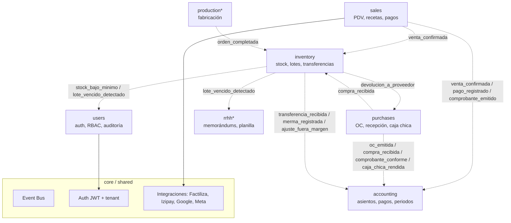

# Mapa de módulos y eventos

Flechas punteadas = eventos por el bus interno (`src/core/events.py`).
Ningún módulo importa el dominio de otro. Catálogo completo con payloads:
[../architecture/events.md](../architecture/events.md).

`*` = módulo futuro.
