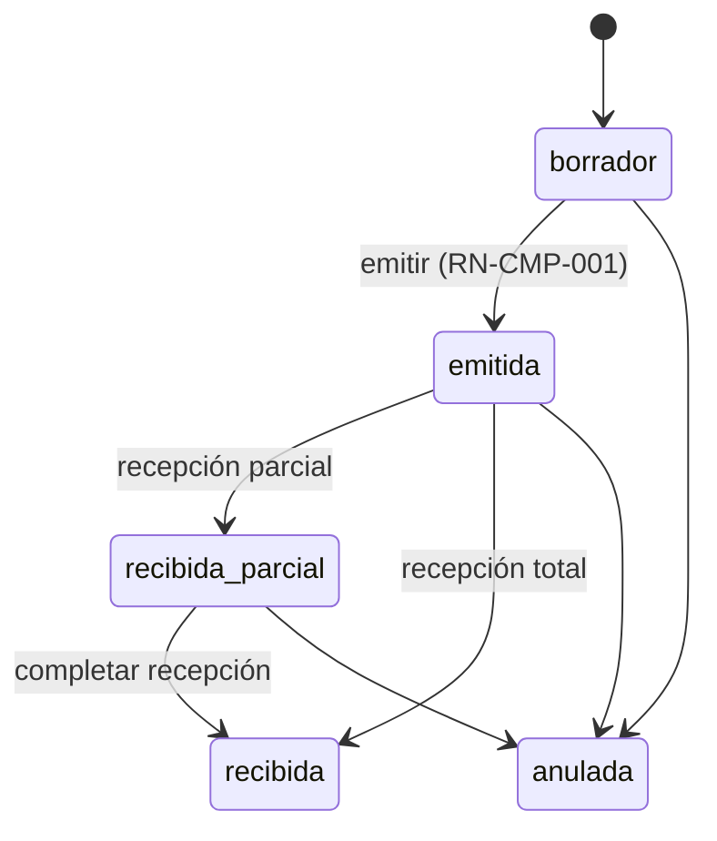
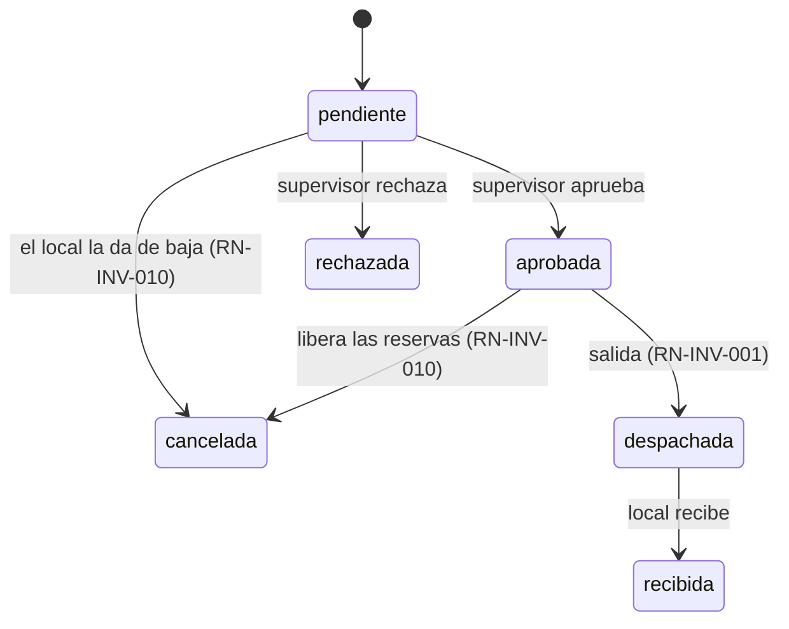
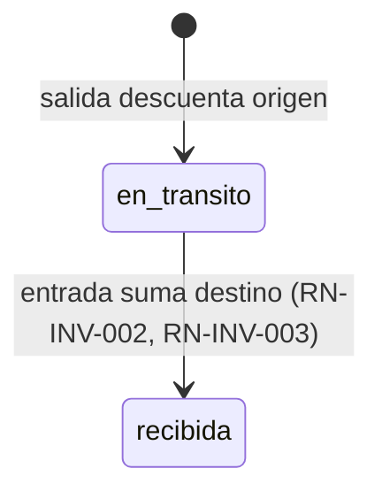
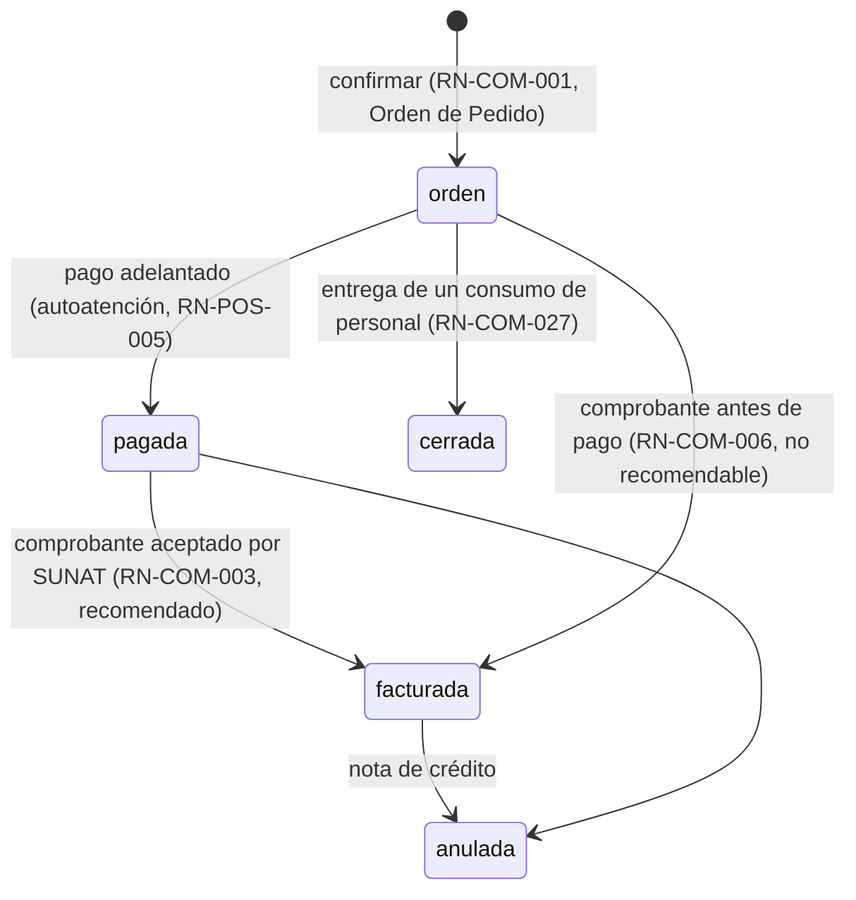
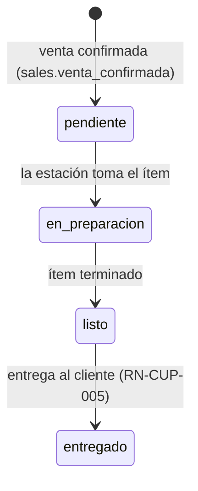
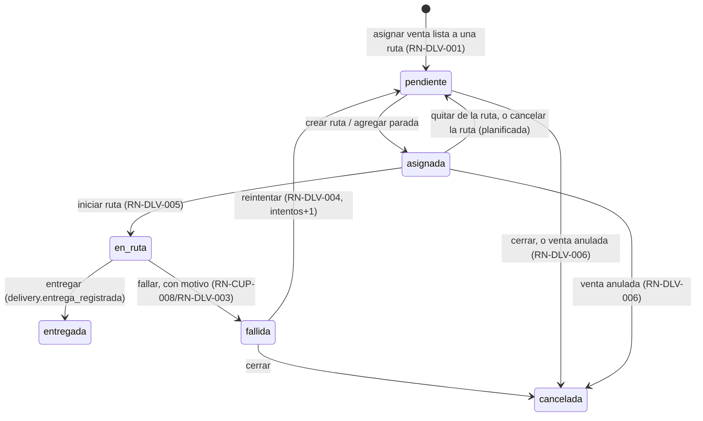
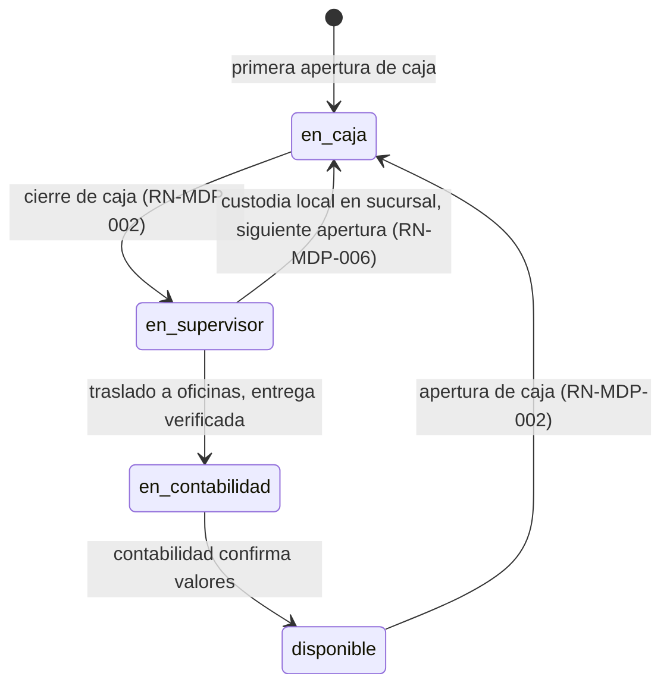
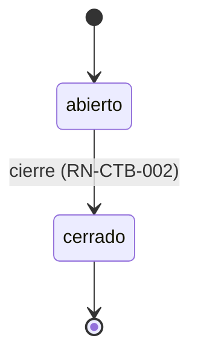

# Máquinas de estado

Ciclo de vida de las entidades con estados. Cada transición puede disparar un
evento ([../architecture/events.md](../architecture/events.md)) y está sujeta a
reglas ([business-rules.md](business-rules.md)). Ninguna transición borra
historia (RN-GEN-002).

## Orden de compra

Eventos: `purchases.oc_emitida` (→emitida), `purchases.compra_recibida`
(→recibida_parcial/recibida).

## Solicitud de insumos

`en_picking` **no existe** (ADR-020, cerrado como descartado 2026-08-07):
entre `aprobada` y `despachada` no cambia qué se puede hacer, así que sería
un estado que alguien tiene que marcar a mano sin que gobierne nada.

## Transferencia

Evento: `inventory.transferencia_recibida` (→recibida).

`en_transito` es el llamado "Almacén de Transporte": no es una ubicación
física, sino el estado del inventario ya descontado de origen y aún no
ingresado a destino. En este estado se puede asignar transportista y
vehículo, con seguimiento GPS y registro de tiempos de ruta/entrega; los
insumos son inamovibles (no cambian de destino) y deben coincidir
exactamente con la guía de remisión (RN-TRP-001/002).

## Venta

**Alcance (2026-07-14): Venta termina en el envío del pedido a cocina y el
cobro** — RN-COM-005. Los estados de preparación/entrega no son de
`venta`: viven en [Cumplimiento de pedido](#cumplimiento-de-pedido)
(`PROC-OPE-002`), abajo.

Pago y comprobante no siguen un orden único: el pago puede ser adelantado,
y el comprobante puede emitirse antes del pago aunque no es recomendable
(RN-COM-006).

`cerrada` es la única salida de una orden que **no se cobra**: hoy solo el
consumo de personal (`venta.tipo = consumo_personal`, ADR-033), que nunca
pasa por caja y por eso no puede terminar en `pagada` ni en `facturada`.
Llegar a `cerrada` desde `pagada` o `facturada` no existe: lo que se cobró
se anula con nota de crédito.

Eventos: `sales.venta_confirmada`, `sales.consumo_personal_registrado`,
`sales.pago_registrado`, `sales.comprobante_emitido`,
`sales.venta_anulada`.

## Cumplimiento de pedido

`PROC-OPE-002` — no es parte de Venta. **La máquina corre por ítem de
venta**, no por venta: cada ítem lo prepara la estación que le toca, y el
pedido hereda el estado de su ítem más atrasado (RN-CUP-003). Persistida
en `venta_item.estado_preparacion`.

Secuencial y sin retroceso (RN-CUP-002): no se salta ni se revierte un
estado. Estado del pedido completo = estado del ítem más atrasado; cuando
todos llegan a `listo` se emite `sales.pedido_listo`, y cuando la entrega
se registra, `sales.venta_entregada`.

Lo que **no** es un estado de esta máquina, a propósito:

- **Entrega fallida** (cliente ausente, rechazo) no es un estado del ítem:
  el ítem sigue `listo` y el intento se registra aparte con su motivo
  (RN-CUP-008). Un pedido no entregado no puede quedar indistinguible de
  uno entregado.
- **Devolución** ocurre después de la entrega y se resuelve por nota de
  crédito y merma, no retrocediendo el avance (RN-CUP-010/012).
- **Pago al finalizar** (mesa, RN-POS-005) es una transición de *Venta*
  (`orden → pagada`), habilitada por la entrega del último pedido de la
  atención (RN-CUP-009) — el "servicio terminado" que antes no tenía dueño
  es hoy la salida de este proceso.

## Reparto propio (módulo delivery, ADR-098)

Dos máquinas nuevas, ninguna reemplaza a `venta_item.estado_preparacion`
de arriba: el ítem sigue `listo` mientras la venta no tenga una `entrega`
en `entregada` — «entregado» del KDS y «entregada» de reparto son el mismo
hecho visto desde dos módulos distintos, conectados por evento
(`delivery.entrega_registrada`, ver [events.md](../architecture/events.md)).

### Entrega

`en_ruta` no vuelve directo a `cancelada`: una salida que ya ocurrió se
cierra por sus resultados (entregada o fallida), nunca se borra a mitad de
camino. La posición del repartidor solo se acepta y se expone mientras la
entrega de esa parada está `en_ruta` (RN-DLV-007).

### Ruta de reparto

```mermaid
stateDiagram-v2
    [*] --> planificada: crear ruta con ≥1 parada
    planificada --> en_curso: iniciar (RN-DLV-005; delivery.ruta_iniciada)
    planificada --> cancelada: cancelar (entregas vuelven a pendiente)
    en_curso --> finalizada: todas las paradas resueltas (delivery.ruta_finalizada)
```

Sin `en_curso → cancelada`, por la misma razón que la entrega: una ruta
que ya salió no se cancela, se termina con lo que haya pasado en cada
parada.

## Custodia de efectivo

Cada transición exige que el receptor confirme que los valores son
correctos antes de tomar responsabilidad (RN-MDP-002). El ciclo normal es
`en_caja → en_supervisor → (en_contabilidad → disponible | directo) →
en_caja`: tras el cierre, el fondo/caja chica se queda en la sucursal
(custodia local) o viaja a contabilidad, según RN-MDP-006.

## Periodo contable

> Al dar estados a una entidad nueva: modelar aquí su máquina antes de
> implementar las transiciones.
