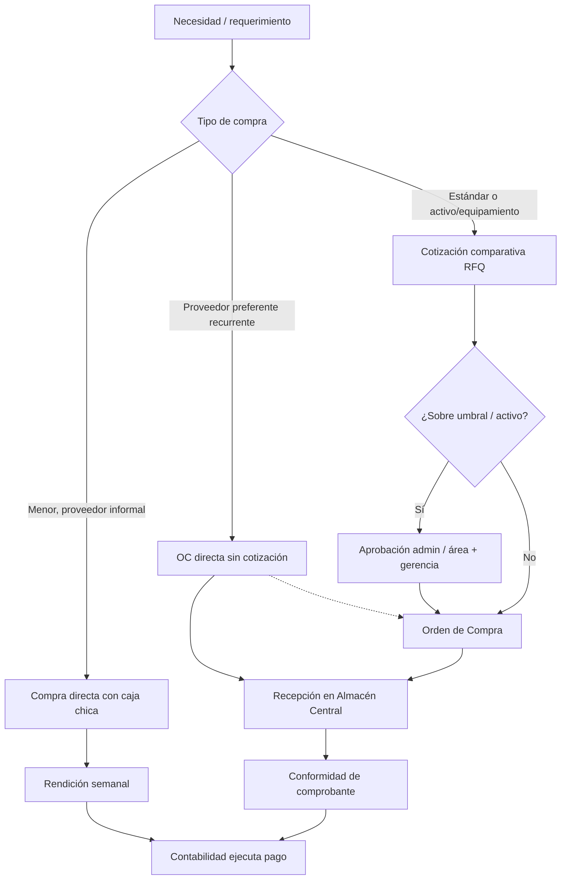
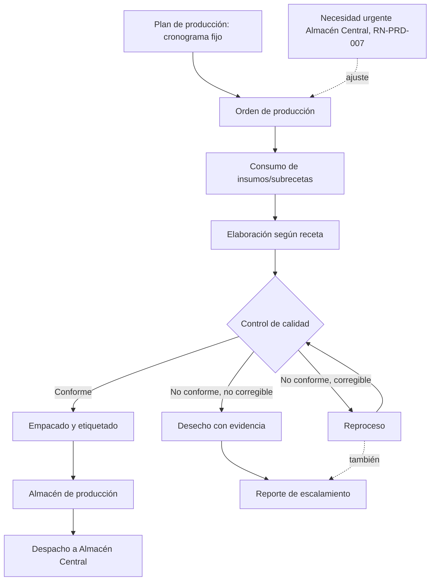
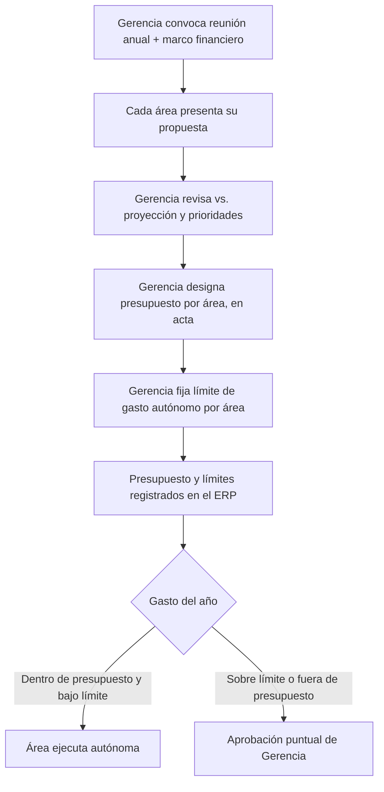
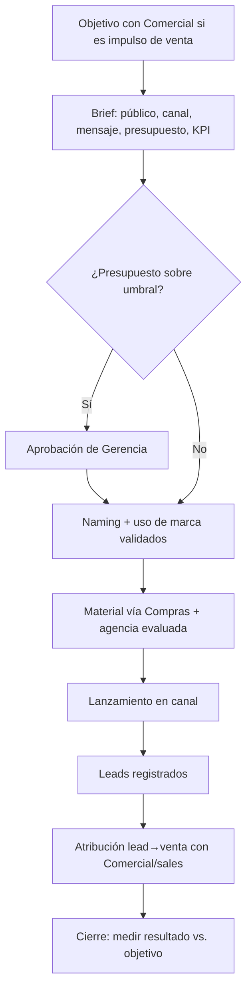
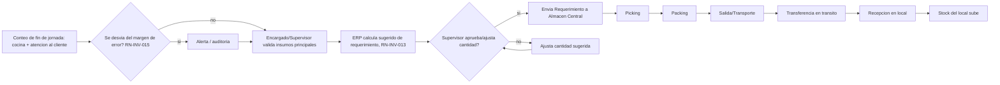
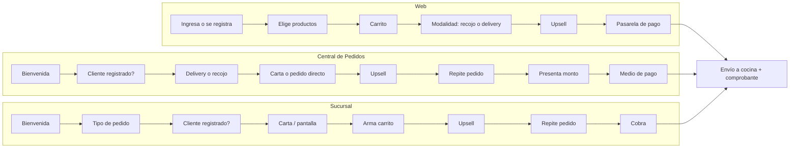
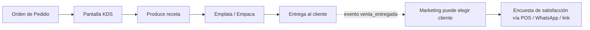
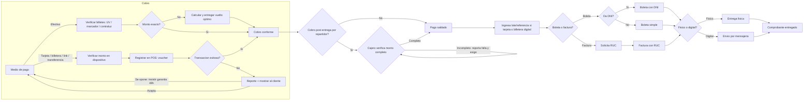
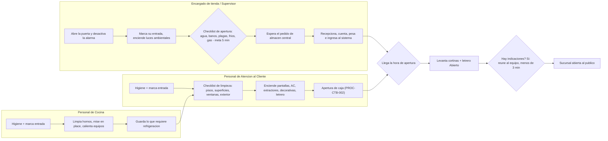

# Flujos operativos

Cada proceso lleva código y versión — nomenclatura y reglas en
[process-nomenclature.md](process-nomenclature.md). Registro maestro con
estado de cada uno: [tabla](process-nomenclature.md#registro-maestro).

## Compras

`PROC-CMP-001` · v2.0 · Vigente

v2.0 (2026-07-19/20): el flujo único proveedor→OC→recepción se reemplaza
por **tres caminos de compra** según proveedor y tipo (decisión del
usuario tras revisar el flujo real); **Contabilidad ejecuta el pago**,
Compras solo sustenta el comprobante conforme. Detalle narrativo y SOPs:
[docs/compras/README.md](../compras/README.md) y
[docs/diagrams/Procesos/Compras/](../diagrams/Procesos/Compras/).



## Producción

`PROC-PRD-001` · v1.0 · Borrador (spec completa; sin operación real —
primera cocina de producción planeada 2027, ver
[docs/produccion/README.md](../produccion/README.md))



Cronograma fijo por tipo de receta/proceso (evita contaminación cruzada,
RN-PRD-012) más ajuste por necesidad de Almacén Central (RN-PRD-011).
Toda orden pasa control de calidad antes de despachar (RN-PRD-013); no
conformidad —corregida o desechada— siempre genera reporte de
escalamiento, con evidencia de destrucción si termina en desecho
(RN-PRD-014/015). Detalle narrativo, SOPs y plantillas:
[docs/produccion/README.md](../produccion/README.md) y
[docs/diagrams/Procesos/Produccion/](../diagrams/Procesos/Produccion/).

Producción también da soporte técnico a I+D+i/Comercial para viabilidad
de nuevo producto (RN-PRD-017) y ejecuta su propio conteo cíclico de
inventario (RN-PRD-016) — ambos fuera de este diagrama por no ser parte
del flujo de una orden de producción.

Dos controles automáticos transversales al flujo, sin mano humana que
transcriba: el ERP calcula el costo real de cada orden (insumos + mano de
obra, con el desperdicio por insumo/tipo contrastado contra lo esperado
en la receta, RN-PRD-018), y el checklist de turno bloquea la cocina y
alerta a Gerencia de inmediato si un equipo de frío queda fuera de rango
(RN-CDP-005).

## Definición del presupuesto anual

`PROC-GER-001` · v1.0 · Borrador (spec del proceso; límites de gasto por
área aún `[[ COMPLETAR ]]`, ver
[docs/gerencia/README.md](../gerencia/README.md))



Cada área presenta su propuesta una vez al año; Gerencia designa el
presupuesto y fija el límite de gasto autónomo por área (RN-GER-007) —
dentro del presupuesto y bajo el límite el área ejecuta sin aprobación
caso por caso; sobre el límite o fuera de lo presupuestado, aprueba
Gerencia (matriz de aprobaciones, RN-GER-003). Detalle:
[docs/diagrams/Procesos/Gerencia/Presupuesto/](../diagrams/Procesos/Gerencia/Presupuesto/).

## Campaña de marketing

`PROC-MKT-001` · v1.0 · Borrador (spec completa; sin ejecución real aún —
área Marketing recién documentada, ver
[docs/marketing/README.md](../marketing/README.md))



Marketing atrae el lead, Comercial cierra la venta e investiga la
oportunidad (RN-MKT-003). Toda campaña sale con brief aprobado; el
contenido es pertinente a la marca, no viral por viral (RN-MKT-002); el
naming y el uso de marca se validan antes (RN-MKT-001/007); el material se
compra vía Compras y se **verifica implementado** en sucursal, no solo
enviado (RN-MKT-004/005). Detalle narrativo, SOPs y plantillas:
[docs/marketing/README.md](../marketing/README.md) y
[docs/diagrams/Procesos/Marketing/](../diagrams/Procesos/Marketing/).

## Abastecimiento de locales

`PROC-INV-001` · v0.2 · Borrador



> Borrador (se revisa/corrige en otra sesión): detalle de conteo en
> sucursal ya está a este nivel; picking/packing/transporte en almacén
> central todavía no.
>
> 1. El conteo de fin de jornada lo hacen Personal de cocina y Personal de
>    atención al cliente, usando balanza, lector QR (si aplica) y el ERP.
>    Empieza al menos 10 minutos antes del cierre de puertas, para dejar
>    todo listo.
> 2. Insumos refrigerados/congelados a medio usar: se pesan en balanza
>    descontando el peso del envase. Insumos aún sellados de almacén
>    central: se escanean por QR o se suma directamente el peso indicado al
>    stock. En ambos casos, no más de 5 minutos fuera de refrigeración.
> 3. Insumos que no se descuentan automáticamente del stock por venta
>    (limpieza, menaje, servilletas, bolsas, etc.) se cuentan aparte, con la
>    periodicidad que le corresponda según la lista de inventario a la que
>    pertenecen (RN-INV-007).
> 4. El conteo se ingresa al ERP → genera un borrador.
> 5. El sistema emite una alerta si el stock declarado se desvía del margen
>    de error configurado (RN-INV-015) → dispara auditoría.
> 6. El Encargado/Supervisor valida el conteo, verificando en persona los
>    insumos principales o más costosos antes de continuar — control
>    cruzado sobre lo que declaró el personal.
> 7. El ERP calcula si hay stock suficiente o si hace falta programar un
>    envío, según el punto de reorden (RN-INV-013).
> 8. Se genera automáticamente un borrador de solicitud de requerimiento
>    (editable); el Encargado/Supervisor puede pedir una cantidad menor a
>    la sugerida si evalúa que no hace falta.
> 9. El Encargado/Supervisor aprueba y envía el Requerimiento a Almacén
>    Central vía ERP.
> 10. Almacén central recibe el pedido y arma el picking.
> 11. En la jornada/turno siguiente, el repartidor entrega los productos en
>     el orden correspondiente.
> 12. Devoluciones o productos no solicitados se fotografían, se suben al
>     ERP, y se devuelven.
> 13. Se verifican montos y se firma.
> 14. Se registra el aumento de stock del almacén de sucursal.

SOPs derivados de este proceso:
[conteo de insumos y envío de requerimiento](../diagrams/Procesos/Logistica-Almacen/Abastecimiento-Locales/conteo-insumos-requerimiento.md),
[picking y despacho en almacén central](../diagrams/Procesos/Logistica-Almacen/Abastecimiento-Locales/picking-despacho-almacen-central.md),
[recepción y devoluciones en local](../diagrams/Procesos/Logistica-Almacen/Abastecimiento-Locales/recepcion-requerimiento-devoluciones.md).

## Venta

`PROC-COM-001` · v1.0 · Vigente

**Alcance (2026-07-14, decisión del usuario): Venta termina con el envío
del pedido a cocina y el cobro.** Preparación, emplatado/empaquetado,
despacho y entrega al cliente NO son parte de Venta — son proceso(s)
posterior(es) todavía sin definir (¿uno solo "Cumplimiento de pedido" o
dos separados "Producción/Cocina" + "Despacho/Entrega"? — pendiente,
usuario aún no decide).

```mermaid
flowchart LR
    PC[Producto comercial] --> RE[Receta] --> DES[Descuenta insumos del almacén del local]
    V[Venta confirmada] --> OP[Orden de Pedido enviada a cocina]
    V --> PG[Pago: efectivo / Izipay] --> CO[Comprobante Nubefact]
    V -. evento sales.venta_confirmada .-> DES
```

Canales: Web (autoatención), Central de Pedidos (llamada/WhatsApp),
Sucursal (mesa/takeout/delivery presencial). Detalle paso a paso de cada
uno, con abandono y resolución: [use-cases.md](use-cases.md) CU-COM-001/002/003.



**Pendiente, fuera del alcance de Venta**: escalamiento de reclamos
post-venta, monitoreo del pedido ya en cocina/camino, manejo de errores
técnicos/demoras del sistema. Desistimiento del cliente durante la toma
del pedido SÍ está cubierto (con resolución) — ver RN-COM-010/011/012 y
`sales.carrito_abandonado` (RN-COM-013).

### Fuera de Venta — borrador sin confirmar (producción/despacho)

Lo siguiente NO es parte del proceso Venta — queda como insumo para cuando
se defina el/los proceso(s) de cumplimiento de pedido:



- KDS muestra la Orden de Pedido ya enviada (no el Carrito); cocina prepara
  siguiendo la receta y sus modificadores/variante resultante.
- Emplatado (mesa) o empaquetado (takeout/delivery) consume el `empaque`
  correspondiente según modalidad (glosario: Empaque).
- La encuesta de satisfacción es opcional y selectiva (marketing decide a
  qué cliente enviarla, no es automática para toda venta).

## Cobro y Emisión de Comprobante de Pago

`PROC-COM-002` · v1.0 · Vigente

Detalle del paso "cobro" dentro de Venta (RN-COM-005, [PROC-COM-001](#venta)).
Empieza en uno de dos momentos: cobro inmediato al confirmar el pedido
(billetera digital, link de pago, transferencia, o efectivo/POS solo si el
cliente está en sucursal) o cobro post-entrega (billetera digital,
transferencia, tarjeta o efectivo, cobrado por el repartidor). Termina con
la entrega del comprobante de pago al cliente. Diagrama BPMN completo:
[PROC-COM-002-v1.0.bpmn](../diagrams/Procesos/Comercial/PROC-COM-002-v1.0.bpmn).

El cajero (Atención al Cliente) es responsable del proceso en todo momento:
si el cobro físico lo ejecuta otro trabajador (repartidor u otro personal),
el cajero debe exigir el monto completo y reportar de inmediato cualquier
falla — de no reportarla, la responsabilidad recae en él.



Garantía ante error de cobro con tarjeta/billetera digital: si el cliente
detecta un doble cobro en las siguientes 48 horas, la empresa lo ayuda a
reclamar ante el banco; si la empresa lo detecta primero, el monto se
retorna al cliente.

## Apertura de sucursal

`PROC-OPE-001` · v1.0 · Vigente

Empieza cuando el encargado de tienda o el supervisor llega a la sucursal,
al menos 45 minutos antes de la hora de apertura al público. Termina con
la sucursal abierta al público (cortinas levantadas, letrero "Abierto").
Reglas: RN-SUC-006 a RN-SUC-012, RN-PER-006. Detalle completo del paso
"apertura de caja": [PROC-CTB-002](#apertura-de-caja). Detalle de la
recepción del pedido de almacén central: pasos 6-9 de
[PROC-INV-001](#abastecimiento-de-locales). Diagrama BPMN completo:
[PROC-OPE-001-v1.0.bpmn](../diagrams/Procesos/Operaciones/PROC-OPE-001-v1.0.bpmn).



Contingencias resueltas dentro del BPMN (gateways del checklist de
apertura): sin agua de red (abre tanque de reserva), sin electricidad
(motor o UPS), rastros de plaga o baños sucios (desinfecta y reporta a
Mantenimiento, no bloquea la apertura — a diferencia de RN-CDP-002 en
cocina de producción), falla de frío (RN-SUC-009: triage NO USAR /
traslado a otro frío / uso normal si conserva frío / reporte urgente a
almacén central y gerencia), falta de gas (RN-SUC-010: tanque de repuesto,
pedido urgente a Compras, proveedor de urgencia, sanción por falta de
aviso).

> Pendiente (BPMN detallado en otra sesión): contingencia de personal
> faltante en apertura (RN-RRHH-011) y de tardanza/falta del encargado o
> supervisor (RN-RRHH-010) — ya tienen regla de negocio, falta el
> diagrama.

## Apertura de caja

`PROC-CTB-002` · v1.0 · Vigente

Empieza cuando el cajero asignado solicita al encargado de tienda/
supervisor el efectivo (fondo/caja chica), los POS de pago con tarjeta y
las llaves de la gaveta. Termina con la caja aperturada en el ERP y el
efectivo asegurado en la gaveta, lista para recibir pedidos y cobros.
Sigue la cadena de custodia obligatoria del efectivo (RN-MDP-002) en
sentido inverso al cierre: área contable/encargado de tienda/supervisor →
cajero, con autenticación (usuario + PIN) y confirmación de valores en el
relevo. Durante el conteo y la apertura, el encargado de tienda/supervisor
no atiende otro proceso (RN-POS-013). Ni el faltante de efectivo, la
escasez de sencillo, ni un POS averiado bloquean la apertura: se abre en
el horario normal dejando constancia del problema (RN-POS-011). Diagrama
BPMN completo:
[PROC-CTB-002-v1.0.bpmn](../diagrams/Procesos/Contabilidad/PROC-CTB-002-v1.0.bpmn).

```mermaid
flowchart LR
    subgraph ca1 ["Cajero"]
        a1[Solicitar al encargado/supervisor: efectivo, POS y llaves de la gaveta]
    end
    a1 --> b1
    subgraph en ["Encargado de tienda / Supervisor"]
        b1[Recibir solicitud y autenticarse: usuario + PIN] --> b2[Contar junto al cajero el efectivo del fondo/caja chica, por denominacion]
        b2 --> b3{Coincide con el monto y denominacion del cierre anterior?}
        b3 -->|No| b4[Reportar a contabilidad y gerencia via ERP: faltante o escasez de sencillo] --> b5
        b3 -->|Si| b5[Revisar que los POS de pago con tarjeta tengan bateria y funcionen]
        b5 --> b6{Todos los POS funcionan?}
        b6 -->|No| b7[Reportar a contabilidad: serie y codigo de comercio del POS averiado; solicitar POS de emergencia RN-POS-009] --> b8
        b6 -->|Si| b8[Entregar efectivo, POS y llaves de la gaveta al cajero, autenticado]
    end
    b8 --> c1
    subgraph ca2 ["Cajero"]
        c1[Ir al terminal de punto de venta fisico y encender la computadora] --> c2[Iniciar el ERP con el modulo de punto de venta]
        c2 --> c3[Ingresar su usuario] --> c4[Abrir el modulo de punto de venta]
        c4 --> c5[Abrir caja indicando el monto de apertura, RN-POS-003] --> c6[Guardar el efectivo ordenado en los casilleros de la gaveta y asegurar con llave]
    end
```



El faltante/escasez de sencillo y la falla de POS reportados en b4/b7 se
resuelven en paralelo, sin detener la apertura (RN-POS-011): buscando
cambio en otro establecimiento o sucursal cercana, solicitando a
contabilidad y recogiendo el cambio en sus oficinas, o usando el POS de
emergencia del grupo de sucursales cercanas (RN-POS-009). Prever sencillo
para la jornada siguiente es responsabilidad del encargado de tienda/
supervisor (RN-POS-012), no solo una reacción al reporte.

## Cierre de caja

`PROC-CTB-001` · v1.1 · Vigente

Empieza al llegar la hora de cierre del establecimiento, dentro del
horario de la jornada (RN-POS-004). Termina con el dinero en custodia
local en la sucursal o a disposición de la empresa en contabilidad, según
RN-MDP-006. Sigue la cadena de custodia obligatoria del efectivo
(RN-MDP-002): cajero → encargado de tienda/supervisor → (área contable, si
corresponde traslado), con autenticación (usuario + PIN) y confirmación de
valores en cada relevo. Diagrama BPMN completo:
[PROC-CTB-001-v1.1.bpmn](../diagrams/Procesos/Contabilidad/PROC-CTB-001-v1.1.bpmn).

```mermaid
flowchart LR
    subgraph ca ["Cajero"]
        a1[Cerrar mesas/cuentas abiertas] --> a2[Contar caja chica por denominación]
        a2 --> a3{Coincide con apertura?}
        a3 -->|No| a4[Registrar diferencia] --> a5
        a3 -->|Si| a5[Contar efectivo de ventas]
        a5 --> a6[Cierre de lote por POS + reporte detallado]
        a6 --> a7[Sistema verifica links de pago de la sucursal]
        a7 --> a8[Caja: Iniciar cierre] --> a9{Dentro del horario de jornada?}
        a9 -->|No| esp[Esperar horario] --> a8
        a9 -->|Si| a10[Ingresar montos reales] --> a11{Cuadra?}
        a11 -->|No| a12[Confirmar o recontar] --> a10
        a11 -->|Si| a13[Preparar sobre: dinero + reportes + cierre]
    end
    a13 --> b1
    subgraph en ["Encargado de tienda / Supervisor"]
        b1[Recibir sobre: usuario + PIN] --> b2{Cierre correcto?}
        b2 -->|No| b3[Reportar irregularidad: contable + gerencia + RRHH] --> b4
        b2 -->|Si| b4[Buen recaudo, sobre sellado y firmado]
        b4 --> b4g{Local seguro (camaras/caja fuerte/alarma) y contabilidad determina poco efectivo?}
        b4g -->|Si, RN-MDP-006| blocal[Custodia local: guardar el sobre en la caja fuerte de la sucursal para la siguiente apertura]
        b4g -->|No| b5[Entregar el sobre al area contable]
    end
    b5 --> c1
    subgraph ac ["Área contable"]
        c1[Recepcionar: usuario + PIN] --> c2[Verificar contenido y valores]
        c2 --> c3{Falta cambio para apertura?}
        c3 -->|Si| c4[Entregar cambio en sobre] --> c5
        c3 -->|No| c5{Hay faltante?}
        c5 -->|Si| c6[Atribuir responsable: RN-MDP-005] --> c7
        c5 -->|No| c7[Dinero a disposición de la empresa]
    end
```

Atribución del faltante — ver [RN-MDP-005](business-rules.md#medio-de-pago):
depende de en qué etapa se detecta y documenta (cierre/validación vs.
recién en contabilidad), y de si el cajero ya había reportado un cobro mal
hecho por un tercero según [PROC-COM-002](#cobro-y-emisión-de-comprobante-de-pago).

## Estados clave

- Solicitud: `pendiente → aprobada|rechazada → en_picking → despachada → recibida`
- Transferencia: `en_transito → recibida` (diferencias registradas y auditadas)
- OC: `borrador → emitida → recibida_parcial → recibida | anulada`
- Venta: confirmación exige stock de receta; anulación genera contramovimientos.
